# AI Financial Close & Reconciliation Platform

> **Production-oriented AI system for investigating financial discrepancies, collecting evidence, applying accounting policy, and coordinating human-approved resolutions.**

This project is designed as a **financial close control room**, not a chatbot.

It combines deterministic accounting logic with AI-assisted investigation, hybrid retrieval, graph reasoning, evidence tracking, human approval, controlled accounting actions, verification, and persistent investigation memory.

The central design principle is:

> **AI investigates and recommends. Deterministic systems validate and execute. Humans approve financial changes.**

---

## Table of Contents

- [1. Overview](#1-overview)

- [2. Problem](#2-problem)

- [3. Goals](#3-goals)

- [4. Core Principles](#4-core-principles)

- [5. System Capabilities](#5-system-capabilities)

- [6. High-Level Architecture](#6-high-level-architecture)

- [7. End-to-End Workflow](#7-end-to-end-workflow)

- [8. Month-End Close Workflow](#8-month-end-close-workflow)

- [9. Transaction Lifecycle](#9-transaction-lifecycle)

- [10. AI Agent Architecture](#10-ai-agent-architecture)

- [11. Reconciliation Architecture](#11-reconciliation-architecture)

- [12. Investigation & Root Cause Analysis](#12-investigation--root-cause-analysis)

- [13. RAG Architecture](#13-rag-architecture)

- [14. Knowledge Graph](#14-knowledge-graph)

- [15. Evidence Graph](#15-evidence-graph)

- [16. Document Intelligence](#16-document-intelligence)

- [17. Human-in-the-Loop](#17-human-in-the-loop)

- [18. Financial Action & Approval Flows](#18-financial-action--approval-flows)

- [19. Accounting Provider](#19-accounting-provider)

- [20. Payment Recovery Flow](#20-payment-recovery-flow)

- [21. Frontend Architecture](#21-frontend-architecture)

- [22. Frontend ↔ Backend Synchronization](#22-frontend--backend-synchronization)

- [23. Data Architecture](#23-data-architecture)

- [24. PostgreSQL as Source of Truth](#24-postgresql-as-source-of-truth)

- [25. Pinecone Investigation Memory](#25-pinecone-investigation-memory)

- [26. Redis](#26-redis)

- [27. Security](#27-security)

- [28. Idempotency](#28-idempotency)

- [29. Failure & Recovery Semantics](#29-failure--recovery-semantics)

- [30. Accounting Period Safety](#30-accounting-period-safety)

- [31. Observability](#31-observability)

- [32. Evaluation](#32-evaluation)

- [33. Testing Strategy](#33-testing-strategy)

- [34. Deployment Architecture](#34-deployment-architecture)

- [35. Environment Variables](#35-environment-variables)

- [36. External Services](#36-external-services)

- [37. Technology Stack](#37-technology-stack)

- [38. Design Tradeoffs](#38-design-tradeoffs)

- [39. Why This Is Not "Just an LLM App"](#39-why-this-is-not-just-an-llm-app)

- [40. Example Investigation](#40-example-investigation)

- [41. Repository Structure](#41-repository-structure)

- [42. Development Principles](#42-development-principles)

- [43. Future Extensions](#43-future-extensions)

---

# 1. Overview

The AI Financial Close & Reconciliation Platform is an agentic financial operations system designed to help finance teams investigate discrepancies during reconciliation and month-end close.

Instead of requiring an accountant to manually move between:

- invoices

- payments

- bank transactions

- general ledger entries

- accounting policies

- receipts

- approval records

- customer information

- previous investigations

the system builds a connected investigation around each discrepancy.

The platform can:

1. ingest financial records and documents

2. normalize and validate data

3. reconcile financial records deterministically

4. detect discrepancies

5. investigate related records

6. retrieve relevant accounting policies and documents

7. traverse connected entities through a knowledge graph

8. construct an evidence trail

9. identify likely root causes

10. produce a recommended resolution

11. request human approval

12. execute only authorized accounting actions

13. verify the resulting accounting state

14. request payment when an adjustment is rejected

15. reconcile subsequent payments

16. store resolved investigations as precedent memory

17. update the close dashboard automatically

---

# 2. Problem

Financial reconciliation is fundamentally a **cross-system reasoning problem**.

A discrepancy may require information from several sources:

```text

Invoice

   │

   ├── Customer

   │

   ├── Invoice Lines

   │

   ├── Credit Note

   │

   └── Payment

          │

          └── Bank Transaction

                  │

                  └── Ledger Entry

                          │

                          └── Account

```

A $500 difference, for example, could represent:

- an approved discount

- an unapplied payment

- a bank timing difference

- a missing credit note

- a refund

- a duplicate payment

- an incorrect ledger entry

- an unsupported adjustment

- a customer short-payment

The system therefore separates:

**Detection → Investigation → Recommendation → Approval → Execution → Verification**

rather than asking an LLM to perform the entire process.

---

# 3. Goals

### Primary goals

- Automate repetitive reconciliation investigation.

- Reduce the amount of manual investigation required per discrepancy.

- Preserve a complete evidence trail.

- Make AI recommendations explainable.

- Keep financial mutations behind deterministic tools and authorization.

- Support human approval and manager escalation.

- Recover interrupted workflows.

- Maintain an auditable state machine.

- Provide a month-by-month financial close dashboard.

- Learn from resolved investigations without allowing memory to become the source of truth.

### Non-goals

The system is not intended to:

- autonomously alter financial records without approval

- replace accounting controls

- let an LLM perform authoritative accounting calculations

- allow frontend code to call privileged financial systems

- silently modify closed accounting periods

- treat vector search results as authoritative financial data

---

# 4. Core Principles

## 4.1 PostgreSQL is authoritative

PostgreSQL is the source of truth for application and financial state.

It owns:

- transactions

- invoices

- payments

- bank transactions

- customers

- accounts

- ledger entries

- journal entries

- discrepancies

- investigations

- recommendations

- approvals

- adjustments

- payment requests

- statuses

- accounting periods

- reports

- audit events

Pinecone, Neo4j, Redis, the frontend, and external accounting providers are **not authoritative**.

---

## 4.2 AI investigates; deterministic code validates

LLMs are useful for:

- hypothesis generation

- evidence synthesis

- document interpretation

- policy interpretation

- root-cause reasoning

- explanation generation

They should not be trusted as the final authority for:

- financial arithmetic

- ledger balances

- journal validation

- period status

- authorization

- idempotency

- accounting mutations

---

## 4.3 Humans control financial modification

The system can recommend:

> "Record a $500 discount adjustment."

It cannot directly decide that the adjustment should happen.

The workflow pauses for approval.

---

## 4.4 Every mutation is auditable

Financial mutations must have:

- actor

- timestamp

- transaction ID

- investigation ID

- approval ID where applicable

- action type

- previous state

- resulting state

- external accounting ID

- workflow version

- reason

---

# 5. System Capabilities

| Capability | Implementation |

|---|---|

| Financial ingestion | CSV/API/document ingestion |

| Document extraction | Qwen2.5-VL-72B |

| Reconciliation | Python + PostgreSQL |

| Semantic retrieval | BGE-M3 + Pinecone |

| Keyword retrieval | BM25 |

| Reranking | BGE reranker |

| Relationship reasoning | Neo4j |

| Investigation | LangGraph + Qwen3 |

| Policy analysis | Policy RAG + Qwen3 |

| Human approval | FastAPI + LangGraph interrupt |

| Manager escalation | Slack |

| Customer notification | Email provider |

| Ledger mutation | AccountingProvider |

| Investigation memory | Pinecone |

| Workflow state | PostgreSQL + LangGraph checkpointing |

| Queue/background execution | Redis |

| Observability | Langfuse + metrics |

| Frontend | Next.js + React |

---

# 6. High-Level Architecture

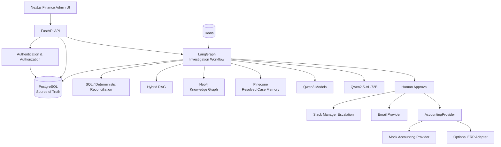

---

# 7. End-to-End Workflow

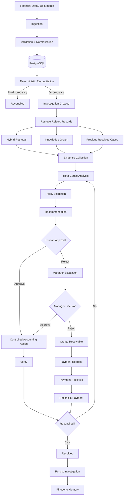

---

# 8. Month-End Close Workflow

The frontend exposes all accounting periods.

Example:

```text

January   February   March   April   May   June   July   August   September   October   November   December

                                                                ▲

                                                            Current Month

```

Each period has:

- status

- transaction count

- reconciled count

- discrepancy count

- open investigations

- approved adjustments

- unresolved amount

- close report

### Close flow

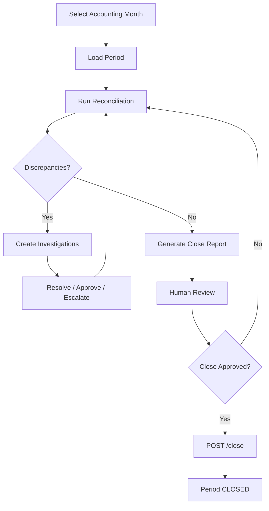

A closed period cannot receive ordinary financial modifications.

Reopening requires:

- authorization

- reason

- audit event

---

# 9. Transaction Lifecycle

The backend owns transaction status.

```text

RECONCILED

DISCREPANCY_DETECTED

INVESTIGATING

AWAITING_HUMAN_APPROVAL

APPROVED

REJECTED

ESCALATED

AWAITING_MANAGER_APPROVAL

ADJUSTMENT_PENDING

ADJUSTED

PAYMENT_REQUESTED

PAYMENT_PENDING

PAYMENT_RECEIVED

RESOLVED

FAILED

```

### State machine

```mermaid

flowchart TD

START([Start]) --> RECONCILED[RECONCILED]
RECONCILED --> DISCREPANCY[DISCREPANCY_DETECTED]
DISCREPANCY --> INVESTIGATING[INVESTIGATING]
INVESTIGATING --> APPROVAL[AWAITING_HUMAN_APPROVAL]

APPROVAL -->|Approve| APPROVED[APPROVED]
APPROVAL -->|Reject| REJECTED[REJECTED]

APPROVED --> PENDING[ADJUSTMENT_PENDING]
PENDING --> ADJUSTED[ADJUSTED]
ADJUSTED --> RESOLVED[RESOLVED]

REJECTED --> ESCALATED[ESCALATED]
ESCALATED --> MANAGER[AWAITING_MANAGER_APPROVAL]
MANAGER -->|Approve| APPROVED
MANAGER -->|Reject| PAYMENT_REQUESTED[PAYMENT_REQUESTED]
PAYMENT_REQUESTED --> PAYMENT_PENDING[PAYMENT_PENDING]
PAYMENT_PENDING --> PAYMENT_RECEIVED[PAYMENT_RECEIVED]
PAYMENT_RECEIVED --> RESOLVED

INVESTIGATING -->|Failure| FAILED_INV[FAILED]
PENDING -->|Failure| FAILED_ADJ[FAILED]

RESOLVED --> END([End])
FAILED_INV --> RECOVERY[Human Review / Recovery]
FAILED_ADJ --> RECOVERY

The frontend cannot arbitrarily set these statuses.

---

# 10. AI Agent Architecture

The system uses specialized agents/nodes rather than one general-purpose agent.

| Agent | Model | Responsibility |

|---|---|---|

| Document Intelligence | Qwen2.5-VL-72B | Extract structured information from financial documents |

| Reconciliation | Qwen3-8B | Interpret deterministic reconciliation results |

| Investigation | Qwen3-14B | Investigate discrepancy and connect evidence |

| Policy | Qwen3-8B | Retrieve and apply accounting policy |

| Root Cause | Qwen3-14B | Evaluate hypotheses and determine likely cause |

| Explanation | Qwen3-8B | Produce clear investigation/close explanations |

| Verification | Qwen3-8B | Interpret post-action verification results |

| Entity Resolution | BGE-M3 + deterministic matching | Resolve entities without LLM-first merging |

The model assignment is intentionally asymmetric.

Complex reasoning receives more model capacity.

Routine structured tasks use smaller models.

---

# 11. Reconciliation Architecture

Reconciliation is primarily deterministic.

Example:

```text

Invoice amount       = $12,400

Payment received     = $11,900

Ledger amount        = $12,400

Expected difference  = $0

Actual difference    = $500

```

The reconciliation engine calculates:

```python

difference = expected_amount - actual_amount

```

The LLM does not decide the arithmetic.

It receives the structured result and investigates why the difference exists.

### Reconciliation pipeline

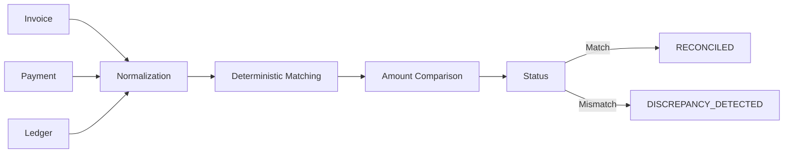

---

# 12. Investigation & Root Cause Analysis

The investigation agent builds hypotheses.

Example:

```text

Hypothesis 1:

Customer made an unauthorized $500 short payment.

Hypothesis 2:

A $500 discount was approved but not recorded.

Hypothesis 3:

A credit note exists but was not applied.

Hypothesis 4:

Bank transaction is incomplete or misclassified.

```

Each hypothesis is evaluated against evidence.

The investigation should not simply output:

> "The discount is the cause."

Instead it should produce:

```text

Hypothesis

Evidence

Contradicting Evidence

Policy

Confidence

Conclusion

```

### Investigation loop

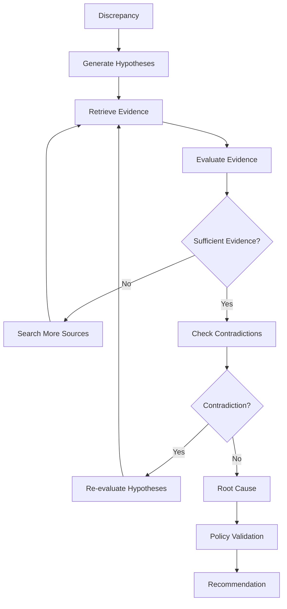

This loop is bounded by a maximum number of iterations/retries.

---

# 13. RAG Architecture

The system uses different retrieval strategies for different data.

## Structured data

Use SQL.

```text

"What was invoice INV-1042?"

→ PostgreSQL

```

## Exact identifiers

Use BM25.

```text

"INV-1042"

"PAY-90017"

"FIN-042"

```

## Semantic policy/document questions

Use vector retrieval.

## Combined evidence

Use hybrid retrieval:

```text

BM25

  +

Vector Search

  ↓

Reciprocal Rank Fusion

  ↓

Cross Encoder Reranking

  ↓

Top Evidence

```

### Retrieval architecture

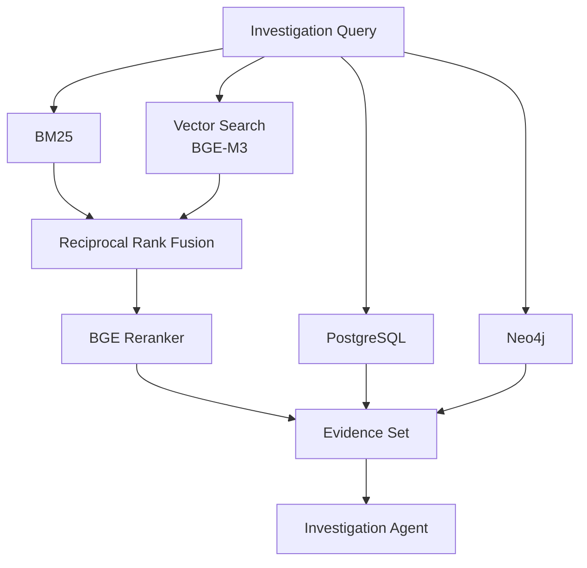

---

# 14. Knowledge Graph

Neo4j represents stable financial relationships.

Example:

```text

Customer

   │

   └── OWNS → Invoice

                 │

                 ├── HAS_LINE → InvoiceLine

                 ├── PAID_BY → Payment

                 └── RECORDED_AS → LedgerEntry

                                      │

                                      └── POSTED_TO → Account

```

Additional relationships include:

```text

Payment → MATCHED_TO → BankTransaction

Invoice → HAS_CREDIT_NOTE → CreditNote

Invoice → HAS_REFUND → Refund

Transaction → INVOLVES → Customer

Discrepancy → INVOLVES → Invoice

Investigation → INVESTIGATES → Discrepancy

Investigation → USES_EVIDENCE → Evidence

Action → REQUIRES_APPROVAL → Approval

Approval → APPROVES → Action

```

### Graph retrieval

Graph traversal is useful when the question requires multiple relationships.

Example:

> "Show everything that could explain this customer's short payment."

The graph can connect:

```text

Customer

 → Invoice

 → Credit Note

 → Payment

 → Bank Transaction

 → Ledger Entry

 → Account

 → Policy

 → Previous Investigation

```

---

# 15. Evidence Graph

The knowledge graph describes the financial universe.

The **evidence graph** describes the current investigation.

These are different concepts.

### Knowledge Graph

Stable:

```text

Invoice INV-1042

    └── belongs to Customer C-102

```

### Evidence Graph

Investigation-specific:

```text

Discrepancy D-88

    │

    ├── supported by → Invoice INV-1042

    ├── supported by → Payment PAY-901

    ├── supported by → Policy FIN-042

    ├── contradicted by → Approval AP-17

    └── supports → "Unrecorded discount"

```

The evidence graph helps preserve **why** the system reached a conclusion.

---

# 16. Document Intelligence

Documents can include:

- invoices

- receipts

- bank statements

- credit notes

- purchase orders

- refund documents

- approval documents

- journal support

The pipeline is:

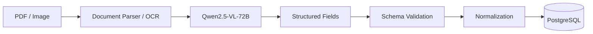

CSV bank statements should not require an LLM.

They should use:

```text

CSV

→ Schema Validation

→ Type Validation

→ Normalization

→ Duplicate Detection

→ PostgreSQL

```

AI is used where interpretation is genuinely useful.

---

# 17. Human-in-the-Loop

Human approval is a hard boundary.

When the investigation reaches:

```text

AWAITING_HUMAN_APPROVAL

```

the LangGraph workflow pauses.

The UI displays:

- discrepancy

- transaction details

- evidence

- retrieved documents

- policies

- root cause

- recommendation

- confidence

- proposed accounting action

- expected financial effect

The administrator can approve or reject.

### Approval architecture

```mermaid

flowchart TD

UI[Next.js UI] -->|POST /investigations/{id}/decision| API[FastAPI]
API --> AUTH[Authenticate & Authorize]
AUTH --> DB[Validate State + Idempotency]
DB --> RESUME[Resume LangGraph Workflow]

RESUME --> DECISION{Human Decision}

DECISION -->|Approved| PENDING[ADJUSTMENT_PENDING]
PENDING --> POLICY[Validate Policy]
POLICY --> AUTHZ[Validate Authorization]
AUTHZ --> PERIOD[Validate Accounting Period]
PERIOD --> JOURNAL[Validate Journal Entry]
JOURNAL --> ACC[Accounting Provider]
ACC --> EXT[External Journal ID]
EXT --> ADJUSTED[ADJUSTED]
ADJUSTED --> VERIFY[Verify Ledger]
VERIFY --> RESOLVED[RESOLVED]

DECISION -->|Rejected| REJECTED[REJECTED]
REJECTED --> ESCALATED[ESCALATED]
ESCALATED --> SLACK[Manager Escalation / Slack]

RESOLVED --> RESPONSE[Decision Accepted / State Updated]
ESCALATED --> RESPONSE
RESPONSE --> UI

---

# 18. Financial Action & Approval Flows

## Approved adjustment

```mermaid

flowchart TD

    A[AWAITING_HUMAN_APPROVAL]

    A --> B[Human Approves]

    B --> C[APPROVED]

    C --> D[ADJUSTMENT_PENDING]

    D --> E[Validate Policy]

    E --> F[Validate Authorization]

    F --> G[Validate Period]

    G --> H[Validate Journal Entry]

    H --> I[AccountingProvider.create_journal_entry]

    I --> J[ADJUSTED]

    J --> K[Verify Ledger]

    K --> L[Re-run Reconciliation]

    L --> M{Difference = 0?}

    M -->|Yes| N[RESOLVED]

    M -->|No| O[Investigate Again]

```

---

## Rejected adjustment

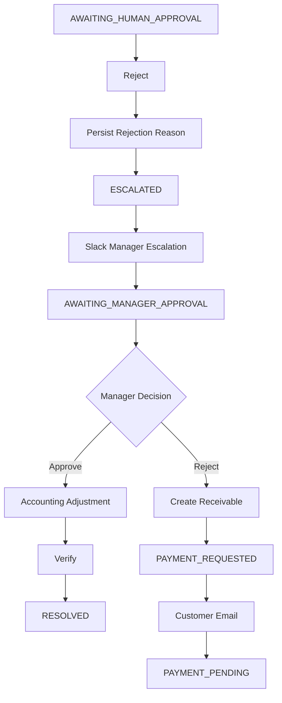

Slack never directly calls the accounting system.

Slack actions route back through the authenticated backend.

---

# 19. Accounting Provider

The system uses an abstraction:

```python

class AccountingProvider:

    def create_journal_entry(...):

        ...

    def get_journal_entry(...):

        ...

    def get_account_balance(...):

        ...

    def verify_transaction(...):

        ...

    def create_receivable(...):

        ...

```

The first implementation is:

```text

MockAccountingProvider

```

The mock provider must maintain actual ledger state.

It should support:

- accounts

- balances

- journal entries

- external IDs

- validation

- idempotency

- failure simulation

- lookups

- verification

It should not simply return:

```json

{"success": true}

```

Optional adapters can later target external accounting systems.

---

# 20. Payment Recovery Flow

Suppose a $500 discount is rejected.

The system does not mark the investigation resolved.

Instead:

```text

Rejected discount

       ↓

Create outstanding receivable

       ↓

Request $500 from customer

       ↓

PAYMENT_PENDING

       ↓

Payment arrives

       ↓

Validate + normalize

       ↓

Persist to PostgreSQL

       ↓

Match payment

       ↓

Reconcile

       ↓

RESOLVED

```

### Payment loop

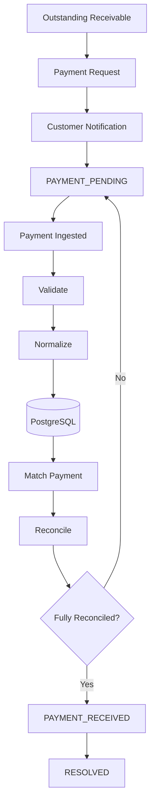

---

# 21. Frontend Architecture

The frontend is a finance operations console.

It should feel like a **financial control room**, not a generic admin dashboard.

### Visual system

```text

Background: #071A2B

Surface:    #0D2638

Primary:    #19C37D

Secondary:  #4ADE80

Text:       #F5F7FA

Muted:      #8FA3B8

Border:     #1B3A4D

```

### Main screens

```text

Dashboard

│

├── Accounting Periods

│   ├── January

│   ├── February

│   ├── ...

│   └── December

│

├── Current Month

│   ├── Reconciliation Summary

│   ├── Transaction List

│   ├── Discrepancy Indicators

│   ├── Open Investigations

│   └── Close Status

│

├── Transaction Investigation

│   ├── Transaction Details

│   ├── Related Records

│   ├── Retrieved Documents

│   ├── Evidence

│   ├── Root Cause

│   ├── Policy

│   ├── Recommendation

│   ├── Approval

│   └── Audit Trail

│

└── Close Report

    ├── Reconciled Transactions

    ├── Discrepancies

    ├── Adjustments

    ├── Outstanding Receivables

    └── Final Close Summary

```

---

## Transaction List

Each transaction displays:

```text

Transaction

Amount

Customer

Invoice

Payment

Status

Difference

Investigation State

```

A visual indicator appears on the same line:

```text

INV-1042     $12,400     Difference: $500     ███████

```

The transaction row is horizontally scrollable where necessary, while the page itself prevents unwanted horizontal overflow.

Clicking a transaction opens the complete investigation.

---

## Investigation Page

The investigation page exposes the complete reasoning context.

```text

┌──────────────────────────────────────────────┐

│ Transaction INV-1042                         │

│ Status: AWAITING_HUMAN_APPROVAL              │

├──────────────────────────────────────────────┤

│ Financial Summary                            │

│ Invoice: $12,400                             │

│ Payment: $11,900                              │

│ Difference: $500                              │

├──────────────────────────────────────────────┤

│ Root Cause                                   │

│ Unrecorded discount                          │

├──────────────────────────────────────────────┤

│ Evidence                                     │

│ • Invoice                                    │

│ • Payment                                    │

│ • Customer history                            │

│ • Policy FIN-042                             │

├──────────────────────────────────────────────┤

│ Recommendation                               │

│ Record $500 adjustment                        │

├──────────────────────────────────────────────┤

│ [Approve Discount] [Reject Discount]          │

└──────────────────────────────────────────────┘

```

The UI should show all evidence returned by the backend.

---

# 22. Frontend ↔ Backend Synchronization

The browser never owns authoritative financial state.

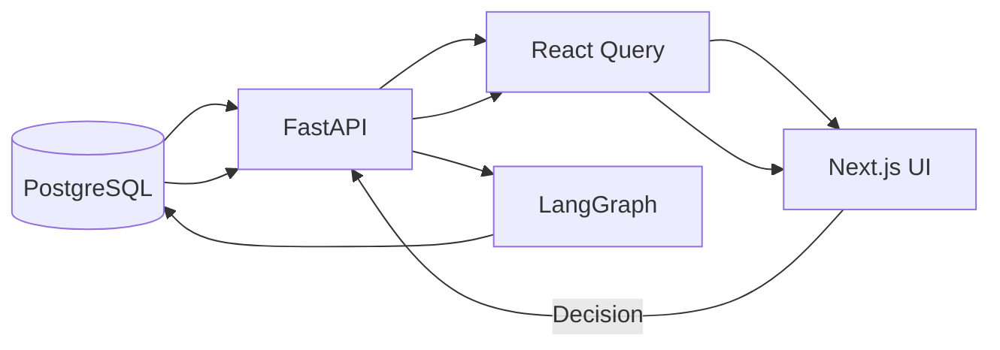

React Query should manage:

- transactions

- investigations

- approvals

- discrepancies

- accounting periods

- close reports

After a decision:

```text

POST decision

     ↓

Invalidate:

  transaction

  investigation

  approval

  discrepancy

  dashboard

  close-period queries

     ↓

Refetch

     ↓

UI reflects PostgreSQL state

```

For long-running workflows, use:

- SSE

- WebSockets

- or controlled polling

so users do not need to manually refresh.

---

# 23. Data Architecture

Core entities:

```text

Customer

Vendor

Employee

Department

BankAccount

Invoice

InvoiceLine

Payment

BankTransaction

CreditNote

Refund

PurchaseOrder

Expense

Account

LedgerEntry

JournalEntry

Policy

Approval

Discrepancy

Investigation

Evidence

Recommendation

Adjustment

PaymentRequest

AccountingPeriod

CloseReport

AuditEvent

```

### Financial relationship

```mermaid

flowchart LR

CUSTOMER[Customer] --> INVOICE[Invoice]
INVOICE --> LINES[Invoice Lines]
INVOICE --> PAYMENT[Payment]
PAYMENT --> BANK[Bank Transaction]
INVOICE --> CREDIT[Credit Note]
INVOICE --> REFUND[Refund]
INVOICE --> LEDGER[Ledger Entry]
LEDGER --> ACCOUNT[Account]
JOURNAL[Journal Entry] --> ACCOUNT

DISCREPANCY[Discrepancy] --> INVESTIGATION[Investigation]
INVESTIGATION --> EVIDENCE[Evidence]
INVESTIGATION --> RECOMMENDATION[Recommendation]
RECOMMENDATION --> APPROVAL[Approval]
APPROVAL --> ADJUSTMENT[Adjustment]

CUSTOMER:::entity
INVOICE:::entity
PAYMENT:::entity
BANK:::entity
LEDGER:::entity
ACCOUNT:::entity
DISCREPANCY:::control
INVESTIGATION:::control
APPROVAL:::control

classDef entity stroke-width:2px
classDef control stroke-width:2px

---

# 24. PostgreSQL as Source of Truth

All important state is persisted in PostgreSQL.

Examples:

```text

transactions

invoices

payments

bank_transactions

ledger_entries

journal_entries

customers

accounts

discrepancies

investigations

recommendations

approvals

adjustments

payment_requests

accounting_periods

close_reports

audit_events

```

The system should always be able to reconstruct:

```text

What happened?

Who approved it?

Why did it happen?

What evidence supported it?

What accounting action occurred?

What was the resulting state?

Was the discrepancy actually resolved?

```

---

# 25. Pinecone Investigation Memory

Pinecone stores resolved investigation precedent.

It is not the financial source of truth.

A resolved case can contain:

```json

{

  "case_id": "CASE-1042",

  "transaction_id": "TX-1042",

  "invoice_id": "INV-1042",

  "customer_id": "C-102",

  "period": "2026-09",

  "discrepancy_type": "SHORT_PAYMENT",

  "expected_amount": 12400,

  "actual_amount": 11900,

  "difference": 500,

  "root_cause": "UNRECORDED_DISCOUNT",

  "confidence": 0.94,

  "evidence_summary": "...",

  "policy": "FIN-042",

  "recommendation": "...",

  "human_decision": "APPROVED",

  "manager_decision": null,

  "action_taken": "JOURNAL_ADJUSTMENT",

  "final_solution": "...",

  "status": "RESOLVED",

  "resolved_at": "2026-09-17T10:30:00Z"

}

```

Future investigations can retrieve similar cases as precedent.

They cannot override current database state or policy.

---

# 26. Redis

Redis supports infrastructure such as:

- background job coordination

- queueing

- caching

- transient workflow data

- rate limiting where required

Long-running investigation work should not depend on a FastAPI request remaining open.

The browser submits a decision.

The backend validates it.

LangGraph resumes the workflow asynchronously.

---

# 27. Security

Security boundaries:


The browser must never directly access:

- PostgreSQL

- Pinecone

- Neo4j

- Slack credentials

- accounting credentials

- email credentials

- LLM provider secrets

All secrets remain server-side.

---

## PII

Financial data can contain sensitive information.

The ingestion pipeline should:

- validate inputs

- minimize unnecessary exposure

- protect secrets

- redact sensitive values where appropriate

- enforce tenant/customer authorization

- log security-relevant events

---

# 28. Idempotency

Every financial mutation must be idempotent.

A double-click must not create two journal entries.

An idempotency key can incorporate:

```text

transaction_id

approval_id

action_type

workflow_version

```

Example:

```text

TX-1042:APP-91:DISCOUNT_ADJUSTMENT:v3

```

Before executing a mutation:

```text

Check idempotency record

       │

       ├── Already executed → return existing result

       │

       └── Not executed → execute

                         ↓

                    persist result

```

---

# 29. Failure & Recovery Semantics

Financial workflows must distinguish different failures.

Example:

```text

Ledger succeeds

Email fails

```

The accounting action remains successful.

The email should be retried separately.

It must not roll back the accounting mutation merely because notification failed.

Similarly:

```text

Slack escalation fails

```

should not erase a persisted rejection.

### Recovery model

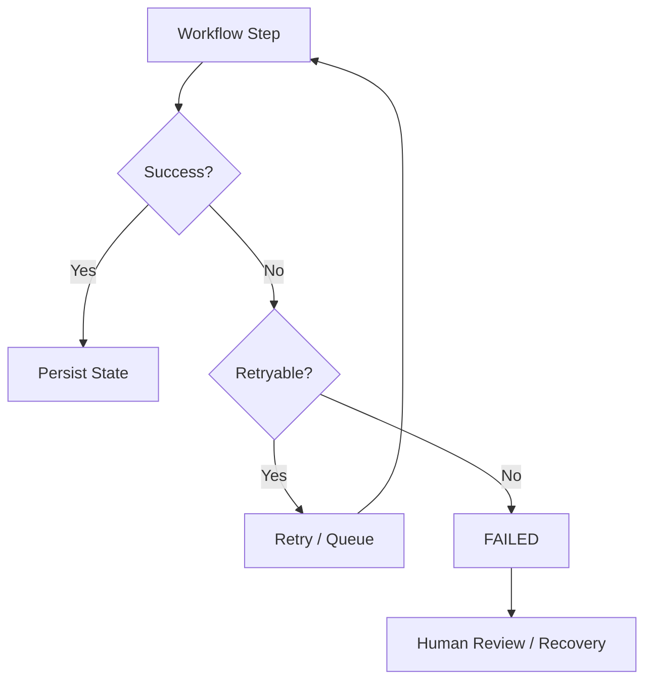

LangGraph checkpointing allows interrupted investigations to resume from persisted state.

---

# 30. Accounting Period Safety

Every financial record belongs to an accounting period.

Operations check:

```text

Is period OPEN?

```

If:

```text

OPEN → ordinary modification allowed

CLOSED → ordinary modification blocked

```

Reopening requires:

- authorized user

- reason

- audit event

No workflow may silently modify a closed period.

---

# 31. Observability

The system should provide visibility into:

### Workflow metrics

- investigation duration

- agent execution time

- retries

- failure rate

- approval latency

- resolution rate

### Retrieval metrics

- retrieval hit rate

- reranker performance

- evidence relevance

- retrieval latency

### Model metrics

- hallucination rate

- faithfulness

- relevancy

- confidence calibration

- structured-output validity

### Financial metrics

- discrepancy count

- discrepancy value

- unresolved value

- adjustments

- payment recovery

- close completion

Langfuse can trace LLM and LangGraph execution.

Prometheus-compatible metrics can expose infrastructure and application metrics.

---

# 32. Evaluation

A golden dataset should contain known cases:

```text

Input transaction

Expected discrepancy

Expected root cause

Expected evidence

Expected policy

Expected recommendation

Expected resolution

```

Example:

```text

Case: CASE-001

Invoice: $12,400

Payment: $11,900

Difference: $500

Expected Root Cause:

Unrecorded approved discount

Expected Evidence:

Invoice

Payment

Approval

Policy FIN-042

Expected Action:

$500 ledger adjustment

Expected Final State:

RESOLVED

```

Evaluate:

- discrepancy detection

- retrieval precision

- evidence relevance

- root-cause accuracy

- policy compliance

- recommendation correctness

- hallucination

- final resolution

- state transition correctness

---

# 33. Testing Strategy

## Unit tests

Test:

- reconciliation calculations

- journal validation

- policy rules

- authorization

- state transitions

- idempotency

- entity normalization

## Integration tests

Test:

- PostgreSQL

- Redis

- Pinecone

- Neo4j

- AccountingProvider

- Slack

- Email

## Workflow tests

### Auto-resolution

```text

Discrepancy

→ Investigation

→ Evidence

→ Recommendation

→ Approval

→ Adjustment

→ Verification

→ Resolved

```

### Human rejection

```text

Approval

→ Reject

→ Slack

→ Manager

```

### Manager rejection

```text

Manager Reject

→ Receivable

→ Payment Request

→ Payment Received

→ Reconcile

→ Resolved

```

### Recovery

```text

Workflow interrupted

→ Worker restart

→ Load checkpoint

→ Resume

```

### Security

Test:

- unauthorized decisions

- tenant isolation

- prompt injection

- malicious documents

- PII exposure

- direct privileged API attempts

---

# 34. Deployment Architecture

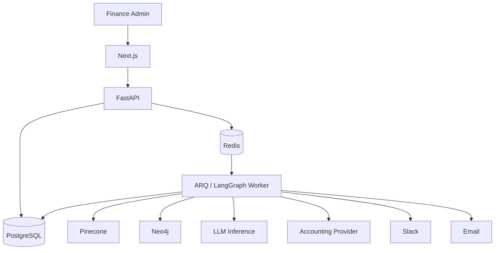

The worker should be independently restartable.

API availability should not depend on an investigation finishing within the HTTP request.

---

# 35. Environment Variables

Example `.env.example`:

```env

DATABASE_URL=

REDIS_URL=

PINECONE_API_KEY=

PINECONE_INDEX=

PINECONE_NAMESPACE=

NEO4J_URI=

NEO4J_USERNAME=

NEO4J_PASSWORD=

SLACK_BOT_TOKEN=

SLACK_SIGNING_SECRET=

SLACK_CHANNEL_ID=

EMAIL_PROVIDER=

EMAIL_API_KEY=

EMAIL_FROM=

LLM_PROVIDER=

LLM_API_KEY=

VISION_MODEL=

ACCOUNTING_PROVIDER=

ACCOUNTING_BASE_URL=

ACCOUNTING_API_KEY=

JWT_SECRET=

LANGFUSE_PUBLIC_KEY=

LANGFUSE_SECRET_KEY=

LANGFUSE_HOST=

```

Never expose these as `NEXT_PUBLIC_*` variables.

---

# 36. External Services

| Service | Purpose | Required |

|---|---|---|

| PostgreSQL | Authoritative application/financial state | Yes |

| Redis | Queue/cache/workflow infrastructure | Yes |

| Pinecone | Resolved investigation memory | Yes |

| Neo4j | Knowledge graph | Recommended |

| LLM provider | Agent reasoning | Yes |

| Qwen2.5-VL-72B | Document intelligence | Yes |

| Slack | Manager escalation | Recommended |

| Email provider | Notifications/payment requests | Yes |

| AccountingProvider | Financial mutations | Yes |

| Langfuse | LLM/workflow observability | Recommended |

| Prometheus-compatible metrics | Operational monitoring | Recommended |

---

# 37. Technology Stack

## Backend

- Python

- FastAPI

- LangGraph

- LangChain where useful

- PostgreSQL

- SQLAlchemy

- Redis

- ARQ

- Pydantic

## AI

- Qwen3-14B

- Qwen3-8B

- Qwen2.5-VL-72B

- BGE-M3

- BGE reranker

- BM25

- hybrid retrieval

- Graph RAG where appropriate

## Data

- PostgreSQL

- Pinecone

- Neo4j

## Frontend

- Next.js

- React

- TypeScript

- React Query

- Tailwind CSS

- charts/dashboard components

## Infrastructure

- Docker

- GitHub

- CI/CD

- Redis

- cloud deployment

## Observability

- Langfuse

- Prometheus-compatible metrics

---

# 38. Design Tradeoffs

## LLM vs deterministic code

### Decision

Use deterministic code for financial calculations and LLMs for reasoning.

### Why

LLMs are probabilistic.

Financial arithmetic, balances, authorization, and journal validation require deterministic behavior.

### Tradeoff

The architecture is more complex because logic is distributed between code and AI.

The benefit is significantly stronger control and auditability.

---

## One large model vs multiple models

### Decision

Use different models for different workloads.

### Why

Document vision and deep investigation require different capabilities from simple explanation or verification.

### Tradeoff

Multiple models increase deployment and operational complexity.

The benefit is lower cost and more appropriate model capacity per task.

---

## Vector RAG vs Graph RAG

### Vector RAG

Good for:

- policy

- procedures

- accounting documents

- semantic similarity

### Graph RAG

Good for:

- multi-hop relationships

- entity connections

- transaction lineage

- connected financial records

### Decision

Use both where useful.

Do not force graph retrieval into questions that SQL or vector retrieval can answer more directly.

---

## Pinecone vs PostgreSQL

### PostgreSQL

Authoritative state.

### Pinecone

Similarity-based precedent retrieval.

### Decision

Keep them separate.

A vector similarity result should never overwrite accounting state.

---

## Neo4j vs SQL joins

SQL is sufficient for many known relationships.

Neo4j becomes valuable when investigations require:

```text

Customer

→ Invoice

→ Payment

→ Bank Transaction

→ Ledger

→ Account

→ Policy

→ Previous Case

```

The tradeoff is additional infrastructure.

---

## Synchronous vs asynchronous execution

### Synchronous

Simple but unsuitable for long investigations.

### Asynchronous

More operational complexity but supports:

- long-running workflows

- retries

- concurrent investigations

- worker restarts

- durable execution

### Decision

Use FastAPI for request handling and Redis/ARQ + LangGraph for background workflows.

---

## Human approval vs autonomous execution

Full autonomy could reduce human workload.

However, financial mutations have consequences.

The system therefore keeps a hard approval boundary.

The tradeoff is that some cases still require human interaction.

That is intentional.

---

## Mock accounting provider vs real ERP

### Mock provider first

Advantages:

- deterministic development

- reproducible tests

- failure simulation

- no external accounting risk

- easier local development

Later, the same interface can support real adapters.

---

## Stateful workflow vs stateless agent

A stateless agent is simpler.

A financial investigation can span:

- multiple searches

- human decisions

- manager escalation

- payment arrival

- retries

- worker restarts

Therefore the system uses stateful LangGraph execution with persisted checkpoints.

---

# 39. Why This Is Not "Just an LLM App"

The LLM is only one component.

The system combines:

```text

                    ┌──────────────────┐

                    │     AI Models    │

                    └────────┬─────────┘

                             │

    ┌────────────────────────┼────────────────────────┐

    │                        │                        │

    ▼                        ▼                        ▼

Structured Data          Retrieval                 Graph

    │                        │                        │

    └────────────────────────┼────────────────────────┘

                             ▼

                       Investigation

                             │

                             ▼

                         Evidence

                             │

                             ▼

                        Root Cause

                             │

                             ▼

                         Policy

                             │

                             ▼

                       Recommendation

                             │

                             ▼

                      Human Approval

                             │

                             ▼

                    Financial Tool Call

                             │

                             ▼

                        Verification

                             │

                             ▼

                       Reconciliation

```

The important engineering challenge is coordinating all of these systems safely.

---

# 40. Example Investigation

Consider:

```text

Invoice: INV-1042

Customer: Acme Manufacturing

Invoice amount: $12,400

Payment: $11,900

Difference: $500

```

Deterministic reconciliation detects:

```text

$12,400 - $11,900 = $500

```

The investigation searches:

- invoice

- customer history

- payment

- bank transaction

- credit notes

- approvals

- accounting policies

- previous resolved investigations

The system finds evidence indicating a $500 discount.

Policy `FIN-042` determines whether the discount requires approval.

The agent recommends:

> Request discount approval. If approved, record a $500 adjustment. If rejected, request the remaining $500 from the customer.

The admin sees the evidence and chooses:

```text

[Approve Discount] [Reject Discount]

```

### If approved

```text

Approve

→ Validate

→ Create journal entry

→ Verify ledger

→ Reconcile

→ Difference = $0

→ RESOLVED

→ Store investigation memory

```

### If rejected

```text

Reject

→ Slack manager escalation

→ Manager approves

→ Ledger adjustment

→ Verify

→ RESOLVED

```

Or:

```text

Manager rejects

→ Create receivable

→ Request $500

→ Payment arrives

→ Reconcile

→ RESOLVED

```

---

# 41. Repository Structure

A suggested structure:

```text

financial-close/

│

├── backend/

│   ├── app/

│   │   ├── api/

│   │   ├── auth/

│   │   ├── agents/

│   │   ├── accounting/

│   │   ├── reconciliation/

│   │   ├── investigation/

│   │   ├── retrieval/

│   │   ├── graph/

│   │   ├── ingestion/

│   │   ├── notifications/

│   │   ├── workflows/

│   │   ├── models/

│   │   ├── schemas/

│   │   ├── services/

│   │   └── main.py

│   │

│   ├── tests/

│   ├── alembic/

│   └── requirements.txt

│

├── frontend/

│   ├── app/

│   │   ├── dashboard/

│   │   ├── transactions/

│   │   ├── investigations/

│   │   ├── approvals/

│   │   └── reports/

│   │

│   ├── components/

│   ├── hooks/

│   ├── lib/

│   └── types/

│

├── knowledge/

│   ├── accounting/

│   ├── policies/

│   ├── procedures/

│   ├── investigation/

│   ├── rag/

│   └── graph/

│

├── documents/

│   ├── invoices/

│   ├── bank_statements/

│   ├── receipts/

│   ├── credit_notes/

│   └── approvals/

│

├── data/

│   ├── customers/

│   ├── invoices/

│   ├── payments/

│   ├── bank_transactions/

│   └── ledger/

│

├── ground_truth/

│   ├── discrepancies/

│   ├── root_causes/

│   ├── evidence/

│   └── expected_resolutions/

│

├── scripts/

├── docker/

├── .env.example

├── docker-compose.yml

└── README.md

```

---

# 42. Development Principles

### 1. Prefer deterministic systems when deterministic systems are sufficient.

### 2. Give the LLM the smallest useful responsibility.

### 3. Persist important state before doing long-running work.

### 4. Never trust frontend state for authorization or financial state.

### 5. Never let an LLM directly mutate financial records.

### 6. Every financial mutation must be idempotent.

### 7. Every important conclusion should have evidence.

### 8. Every financial action should be verifiable.

### 9. Closed accounting periods require explicit controls.

### 10. Retrieval systems provide context, not authority.

### 11. Previous cases are precedent, not truth.

### 12. Human approval is a system boundary, not a UI decoration.

---

# 43. Future Extensions

Potential future capabilities include:

- ERP integrations

- bank API integrations

- automated statement ingestion

- anomaly detection

- cash forecasting

- continuous reconciliation

- multi-entity consolidation

- foreign currency reconciliation

- intercompany reconciliation

- duplicate invoice detection

- fraud-risk signals

- accounting-period anomaly detection

- richer financial graph analytics

- automated close readiness scoring

- policy version tracking

- department-specific operational dashboards

---

# Architecture Summary

The system can be summarized as:

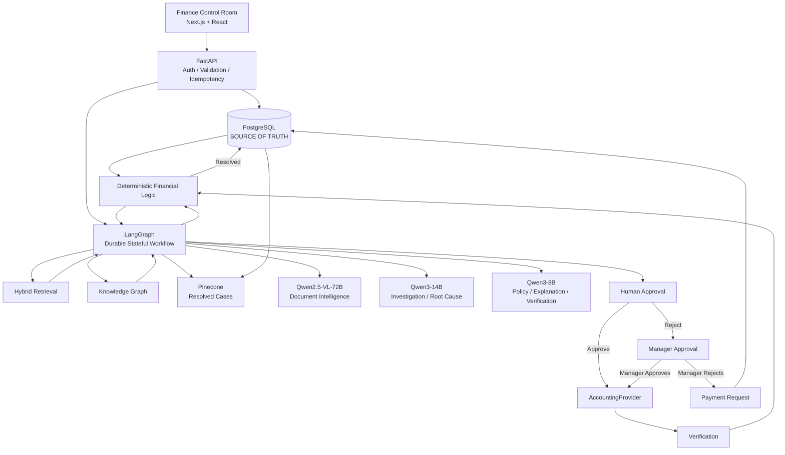

The result is a system where **financial truth remains deterministic and auditable, while AI handles the parts of financial operations that require interpretation, investigation, evidence synthesis, and workflow coordination.**