# AI Financial Close & Reconciliation Platform

## Architecture Design

> Production-oriented AI financial operations system for investigating reconciliation discrepancies, collecting evidence, applying accounting policy, generating explainable recommendations, coordinating human approvals, executing controlled financial actions, and verifying resolution.

The system is designed as a **financial close control room**, not a chatbot.

Its core principle is:

> **AI investigates and recommends. Deterministic systems validate. Humans approve financial changes. Controlled backend tools execute them. PostgreSQL remains the source of truth.**

---

# Table of Contents

1. Overview
2. Problem
3. Goals
4. Non-Goals
5. Core Architectural Principles
6. System Capabilities
7. High-Level Architecture
8. Frontend → Backend → LangGraph Architecture
9. Investigation Trigger Model
10. Transaction Lifecycle
11. Investigation Workflow
12. AI Agent Architecture
13. Agent Responsibilities
14. Reconciliation Architecture
15. Overpayment Detection
16. Evidence Architecture
17. Retrieval Architecture
18. PostgreSQL Financial Relationships
19. Neo4j Knowledge Graph
20. Pinecone Investigation Memory
21. Document Intelligence
22. Investigation Output Contract
23. AI-Generated Customer Communication
24. Human Approval Architecture
25. Reject & Escalate Flow
26. Manager Escalation
27. Manager Decision Flow
28. Customer Payment Recovery
29. Overpayment Refund Flow
30. Accounting Provider
31. Journal Entry Execution
32. Verification
33. Financial State Machine
34. Frontend Architecture
35. Financial Close Dashboard
36. Transaction List
37. Transaction Investigation Page
38. Evidence Presentation
39. Agent Findings UI
40. Customer Email Draft UI
41. Manager Escalation UI
42. Search and Filtering
43. Contextual Page Search
44. Navigation and Back Behavior
45. User Account Records
46. Frontend State Synchronization
47. API Architecture
48. API Endpoints
49. Data Model
50. Investigation Persistence
51. Redis and ARQ
52. LangGraph Persistence
53. LLM Provider Architecture
54. LLM Fallback Strategy
55. Insight Schema
56. AgentMail
57. Notification Failure Semantics
58. Security
59. Authentication and Authorization
60. Idempotency
61. Accounting Period Safety
62. Auditability
63. Observability
64. Evaluation
65. Testing Strategy
66. Failure and Recovery
67. Deployment Architecture
68. Environment Variables
69. External Services
70. Technology Stack
71. Design Tradeoffs
72. Example Investigation
73. Repository Structure
74. Development Principles
75. Final Architecture

---

# 1. Overview

The AI Financial Close & Reconciliation Platform helps finance teams investigate discrepancies during financial close.

Instead of requiring an administrator to manually inspect:

* invoices
* payments
* bank transactions
* ledger entries
* customers
* credit notes
* refunds
* accounting policies
* approval records
* previous investigations
* supporting documents

the platform creates a structured investigation around a specific transaction.

The system can:

1. ingest financial records
2. normalize financial data
3. reconcile transactions deterministically
4. detect discrepancies
5. allow an administrator to explicitly start an investigation
6. retrieve related financial records
7. retrieve supporting documents
8. retrieve accounting policies
9. query the financial knowledge graph
10. retrieve similar resolved cases
11. construct an evidence set
12. allow specialized agents to analyze the evidence
13. generate root-cause hypotheses
14. determine the most likely root cause
15. calculate confidence
16. generate a recommendation
17. generate a customer communication draft when required
18. generate a manager escalation draft when required
19. pause for human approval
20. execute only authorized financial actions
21. verify the resulting financial state
22. update PostgreSQL
23. save resolved investigations to Pinecone
24. update the frontend without manual refresh

The system is deliberately **not fully autonomous**.

Financial modifications always require explicit authorization.

---

# 2. Problem

Financial reconciliation is a cross-system reasoning problem.

A single discrepancy may involve:

```text
Customer
   ↓
Invoice
   ↓
Payment
   ↓
Bank Transaction
   ↓
Ledger Entry
   ↓
Account
```

while the explanation may additionally require:

```text
Policy
Approval
Credit Note
Refund
Customer History
Previous Investigation
Supporting Document
```

For example:

```text
Invoice:       $12,400
Payment:       $13,?00
Expected:      $12,400
Actual:        $14,015.86
Difference:    $1,615.86
```

The discrepancy could represent:

* overpayment
* unapplied cash
* duplicate payment
* incorrect invoice amount
* timing difference
* incorrect ledger entry
* refund that was not recorded
* payment applied to the wrong invoice

The system therefore separates:

```text
Detection
   ↓
Investigation
   ↓
Evidence
   ↓
Root Cause
   ↓
Recommendation
   ↓
Human Decision
   ↓
Controlled Financial Action
   ↓
Verification
   ↓
Resolution
```

---

# 3. Goals

The system must:

* reduce manual investigation effort
* preserve an evidence trail
* explain why an AI reached a conclusion
* expose the financial relationships behind each transaction
* allow administrators to investigate transactions individually
* never automatically investigate every transaction merely because it exists
* support deterministic reconciliation
* support AI-assisted investigation
* support Human-in-the-Loop approval
* support manager escalation
* support customer communication drafts
* support payment recovery
* support overpayment/refund workflows
* preserve complete audit history
* support durable workflow execution
* support worker restarts
* support retries
* prevent duplicate financial mutations
* protect accounting periods
* provide searchable and filterable financial data
* make every investigation understandable to a finance administrator

---

# 4. Non-Goals

The system must not:

* allow an LLM to directly modify financial records
* allow the browser to access PostgreSQL directly
* allow the browser to access Pinecone directly
* allow the browser to access Neo4j directly
* allow the browser to access accounting APIs directly
* automatically investigate every transaction
* automatically approve financial recommendations
* automatically post financial adjustments
* treat Pinecone as financial truth
* treat Neo4j as financial truth
* treat an LLM response as financial truth
* silently modify closed accounting periods
* expose secrets through frontend code
* mark an unresolved payment discrepancy as resolved simply because an email was sent

---

# 5. Core Architectural Principles

## 5.1 PostgreSQL is the source of truth

PostgreSQL owns authoritative application and financial state.

This includes:

* transactions
* invoices
* payments
* customers
* bank transactions
* ledger entries
* journal entries
* discrepancies
* investigations
* evidence metadata
* recommendations
* approvals
* adjustments
* payment requests
* refunds
* accounting periods
* audit events
* notifications
* workflow state

Pinecone, Neo4j, Redis, the frontend, and external providers are not authoritative.

---

## 5.2 AI investigates; deterministic systems validate

LLMs may perform:

* reasoning
* hypothesis generation
* document interpretation
* policy interpretation
* evidence synthesis
* root-cause analysis
* explanation generation
* communication drafting

Deterministic code must handle:

* financial arithmetic
* amount calculations
* reconciliation
* journal validation
* accounting period validation
* authorization
* state transitions
* idempotency
* financial mutations

---

## 5.3 Humans control financial modifications

The AI can recommend:

```text
Refund $1,615.86 to customer.
```

It cannot execute the refund automatically.

The required flow is:

```text
AI Investigation
      ↓
Root Cause
      ↓
Recommendation
      ↓
Customer Draft
      ↓
Human Review
      ↓
Human Approval
      ↓
Backend Authorization
      ↓
Controlled Tool
      ↓
Financial Operation
      ↓
Verification
```

---

## 5.4 Every important conclusion requires evidence

An investigation should never simply display:

```text
Root Cause: Overpayment
Confidence: 85%
```

It must show:

```text
Root Cause
Overpayment of $1,615.86.

Why:
The payment exceeds the open invoice balance.

Evidence:
- Payment record
- Invoice
- Ledger
- Customer account
- Bank transaction
- Previous related cases
```

---

# 6. System Capabilities

| Capability                     | Implementation             |
| ------------------------------ | -------------------------- |
| Financial ingestion            | API / CSV / documents      |
| Reconciliation                 | Deterministic Python logic |
| Investigation                  | LangGraph                  |
| Structured financial state     | PostgreSQL                 |
| Background execution           | Redis + ARQ                |
| Semantic retrieval             | Vector search              |
| Keyword retrieval              | BM25                       |
| Reranking                      | Cross Encoder              |
| Graph reasoning                | Neo4j                      |
| Previous investigations        | Pinecone                   |
| Document intelligence          | Qwen2.5-VL-72B             |
| Investigation reasoning        | Llama 3.3 70B              |
| LLM fallback                   | Llama 3.1 8B               |
| Policy analysis                | LLM + retrieval            |
| Human approval                 | FastAPI + LangGraph        |
| Customer email drafting        | LLM                        |
| Customer email sending         | AgentMail                  |
| Manager escalation             | Slack                      |
| Financial mutations            | AccountingProvider         |
| Accounting development backend | MockAccountingProvider     |
| Observability                  | Langfuse                   |
| Frontend                       | Next.js + React            |
| Frontend data synchronization  | React Query                |

---

# 7. High-Level Architecture

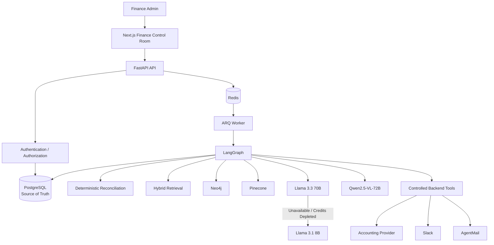

---

# 8. Frontend → Backend → LangGraph Architecture

The browser must never call privileged services directly.

Required architecture:

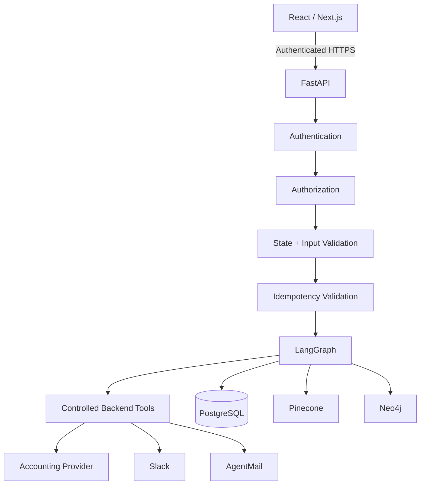

The browser never directly communicates with:

```text
PostgreSQL
Pinecone
Neo4j
Slack
AgentMail
Accounting Provider
```

---

# 9. Investigation Trigger Model

## Critical rule

**Transactions must not automatically run AI investigations.**

The system may deterministically identify a discrepancy, but the AI investigation starts only when an authorized administrator requests it.

Required flow:

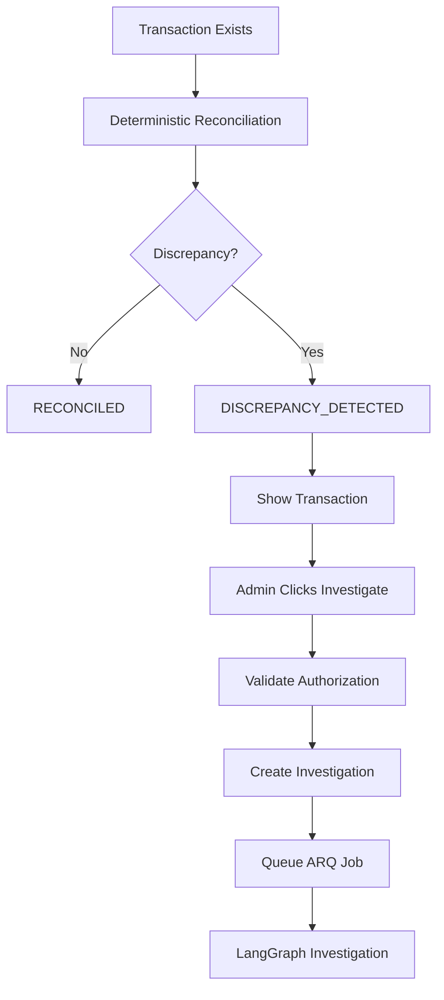

The transaction page must expose:

```text
[ Investigate ]
```

before the AI investigation starts.

Once investigation begins:

```text
Investigate
→ disabled
→ Investigation Running
→ results progressively appear
```

---

# 10. Transaction Lifecycle

Every transaction has a persisted backend-controlled status.

Required states:

```text
RECONCILED
DISCREPANCY_DETECTED
INVESTIGATING
AWAITING_HUMAN_APPROVAL
APPROVED
REJECTED
ESCALATED
AWAITING_MANAGER_APPROVAL
ADJUSTMENT_PENDING
ADJUSTED
PAYMENT_REQUESTED
PAYMENT_PENDING
PAYMENT_RECEIVED
RESOLVED
FAILED
```

---

# 11. Investigation Workflow

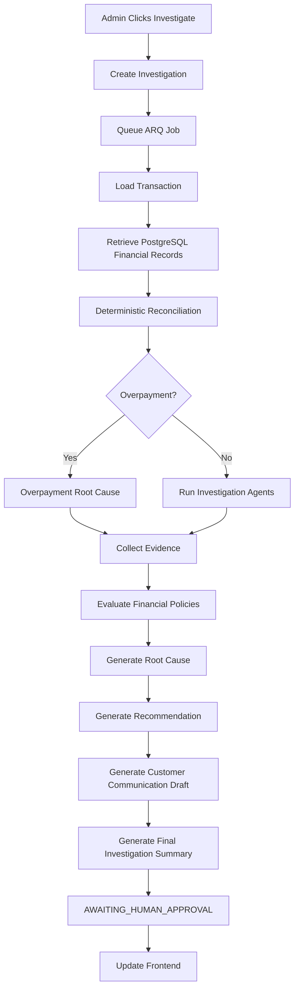

---

# 12. AI Agent Architecture

The investigation uses specialized nodes/agents.

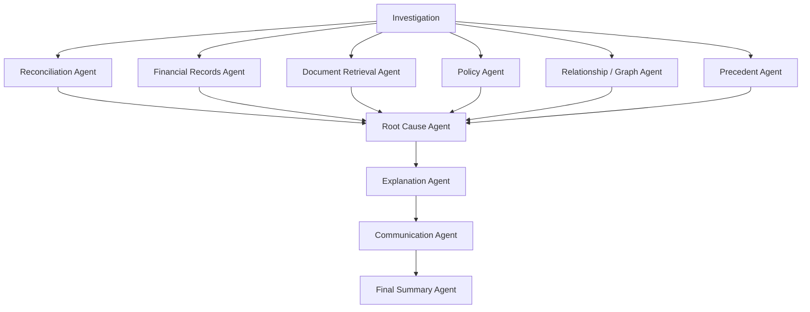

---

# 13. Agent Responsibilities

## Reconciliation Agent

Consumes deterministic reconciliation results.

It must not calculate authoritative financial amounts itself.

It explains:

* expected amount
* actual amount
* difference
* matching status
* missing records
* duplicate records
* overpayment
* underpayment

---

## Financial Records Agent

Retrieves:

* transaction
* invoice
* payment
* customer
* account
* ledger
* bank transaction
* credit note
* refund
* previous adjustments

---

## Document Retrieval Agent

Retrieves supporting documents.

Each retrieved document must contain:

```text
document_id
document_name
document_type
page
content
relevance_score
confidence
source
agent
```

---

## Policy Agent

Retrieves:

* accounting policies
* approval policies
* discount policies
* refund policies
* payment policies
* period policies

---

## Graph Agent

Uses Neo4j to understand relationships such as:

```text
Customer
 ↓
Invoice
 ↓
Payment
 ↓
Bank Transaction
 ↓
Ledger
 ↓
Account
```

---

## Precedent Agent

Queries Pinecone for similar resolved investigations.

Pinecone results are context only.

They cannot override PostgreSQL.

---

## Root Cause Agent

Produces:

```text
root_cause
confidence
supporting_evidence
contradicting_evidence
reasoning_summary
```

---

## Communication Agent

Creates:

* customer email draft
* manager escalation draft

It does not send them automatically unless the workflow explicitly reaches the relevant authorized notification step.

---

## Final Summary Agent

Produces a complete human-readable summary.

It must include:

```text
What happened
Why it happened
Financial impact
Evidence
Policy
Root cause
Confidence
Recommendation
Customer communication
Required human decision
```

---

# 14. Reconciliation Architecture

Financial calculations are deterministic.

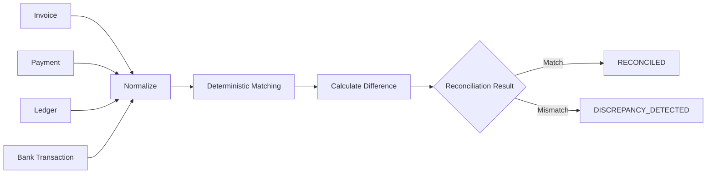

The LLM receives the deterministic result.

It does not replace it.

---

# 15. Overpayment Detection

Overpayment is handled deterministically.

Example:

```text
Expected: $12,400.00
Actual:   $14,015.86

Difference:
$1,615.86
```

If:

```text
actual_amount > expected_amount
```

the reconciliation engine should identify:

```text
OVERPAYMENT
```

and persist:

```text
discrepancy_type = OVERPAYMENT
```

The investigation should transition to:

```text
AWAITING_HUMAN_APPROVAL
```

once sufficient deterministic evidence confirms the discrepancy.

The AI should then explain:

```text
The customer paid $1,615.86 more than the outstanding invoice balance.

Recommended action:
Refund $1,615.86 or apply the excess payment to another outstanding invoice.

Customer communication:
Generated draft explaining the next step.
```

---

# 16. Evidence Architecture

Evidence is a first-class object.

Every investigation should preserve:

```text
Evidence
├── PostgreSQL Record
├── Ledger Record
├── Pinecone Result
├── Neo4j Relationship
├── Retrieved Document
├── Policy
├── Customer Record
└── Previous Investigation
```

Each evidence item should include:

```text
id
source
source_type
title
content
page
relevance
confidence
agent
retrieved_at
supports
contradicts
```

---

# 17. Retrieval Architecture

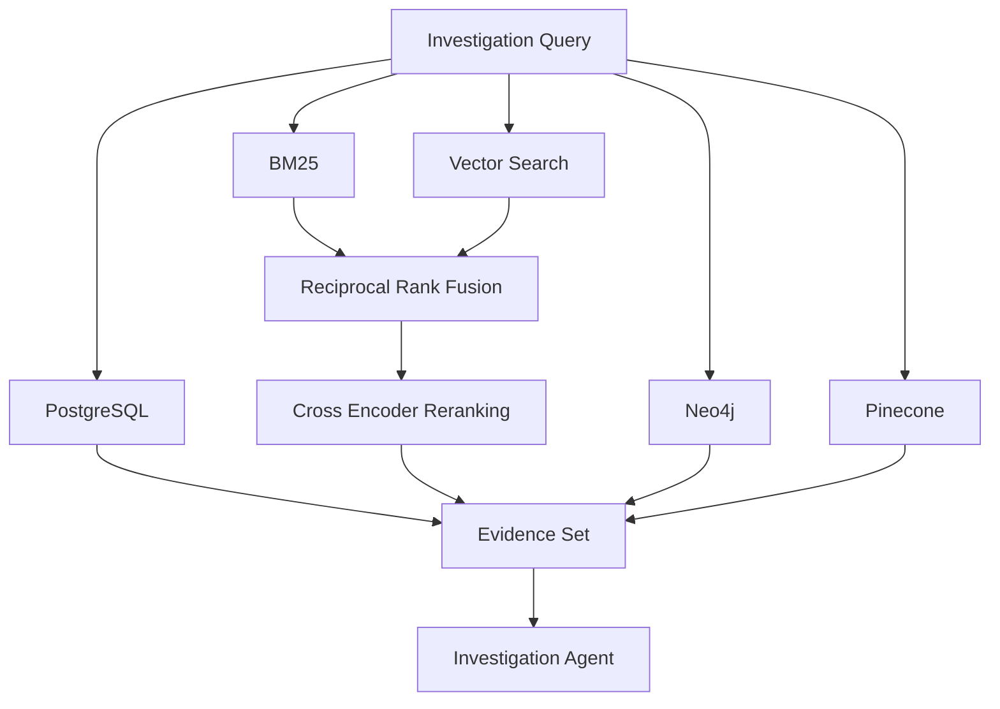

Structured financial data should preferentially use SQL.

Exact identifiers should use BM25.

Semantic document retrieval should use vector search.

Multi-hop relationships should use Neo4j.

Historical precedent should use Pinecone.

---

# 18. PostgreSQL Financial Relationships

PostgreSQL should provide the authoritative financial relationships displayed to the admin.

For a transaction, the frontend should be able to display:

```text
Transaction
├── Customer
├── Invoice
├── Payment
├── Bank Transaction
├── Ledger Entries
├── Account
├── Credit Notes
├── Refunds
├── Discrepancies
├── Investigation
├── Recommendations
├── Approvals
├── Journal Entries
└── Payment Requests
```

---

# 19. Neo4j Knowledge Graph

Neo4j represents relationships.

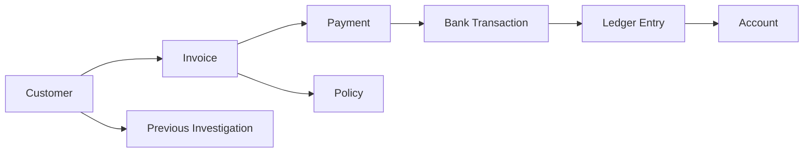

Neo4j is useful for questions such as:

```text
What financial records are connected to this transaction?
```

or:

```text
What previous cases involved this customer, invoice, policy, and payment relationship?
```

---

# 20. Pinecone Investigation Memory

Resolved investigations are stored in Pinecone as precedent.

A memory record contains:

```json
{
  "case_id": "CASE-1042",
  "transaction_id": "TX-1042",
  "invoice_id": "INV-1042",
  "customer_id": "C-102",
  "period": "2026-09",
  "discrepancy_type": "OVERPAYMENT",
  "expected_amount": 12400,
  "actual_amount": 14015.86,
  "difference": 1615.86,
  "root_cause": "OVERPAYMENT",
  "root_cause_confidence": 0.95,
  "evidence_summary": "...",
  "policy": "FIN-042",
  "recommendation": "...",
  "human_decision": "APPROVED",
  "manager_decision": null,
  "action_taken": "REFUND",
  "final_solution": "...",
  "resolution_status": "RESOLVED",
  "resolved_at": "2026-09-21T10:30:00Z"
}
```

Pinecone is precedent, not truth.

---

# 21. Document Intelligence

Documents may include:

* invoices
* receipts
* bank statements
* credit notes
* refund documents
* approval documents
* journal support

Pipeline:

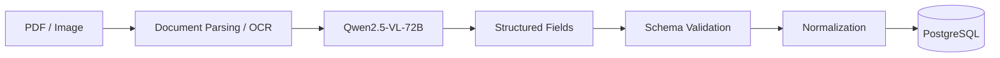

Every document retrieval result must preserve the page number when page-level information exists.

---

# 22. Investigation Output Contract

The investigation response must be structured.

Example:

```json
{
  "transactionId": "TX-2496",
  "period": "2026-09",
  "status": "AWAITING_HUMAN_APPROVAL",
  "severity": "HIGH",
  "discrepancy": {
    "type": "OVERPAYMENT",
    "expected": 12400,
    "actual": 14015.86,
    "difference": 1615.86
  },
  "rootCause": {
    "title": "Customer overpayment",
    "description": "Payment exceeded the open invoice balance.",
    "confidence": 0.95
  },
  "evidence": [],
  "agentFindings": [],
  "recommendation": {
    "title": "Refund unapplied cash",
    "description": "Refund $1,615.86 to the customer or apply it to another outstanding invoice."
  },
  "customerEmailDraft": {
    "subject": "...",
    "body": "..."
  },
  "managerEscalationDraft": null,
  "finalSummary": "..."
}
```

---

# 23. AI-Generated Customer Communication

For discrepancies requiring customer communication, the AI must create a draft.

The AI must not invent financial facts.

The draft must be based on:

* PostgreSQL records
* verified amounts
* verified invoice
* verified payment
* verified root cause
* approved policy
* investigation result

For an overpayment:

```text
Customer paid:
$14,015.86

Invoice balance:
$12,400.00

Unapplied amount:
$1,615.86
```

The AI may draft:

```text
We received a payment that exceeds the current outstanding balance on your account.

The unapplied amount is $1,615.86.

We can either apply this amount to another outstanding invoice, where applicable, or arrange a refund.

Please let us know how you would like us to proceed.
```

The actual amount must come from deterministic financial data.

---

# 24. Human Approval Architecture

The investigation page must show all information required before approval.

Required ordering:

```text
Transaction
↓
Severity
↓
Financial Summary
↓
What Happened
↓
Root Cause
↓
Evidence
↓
Agent Findings
↓
Retrieved Documents
↓
Policies
↓
Recommendation
↓
Customer Email Draft
↓
Financial Impact
↓
Journal / Proposed Action
↓
Approval Controls
```

The approval controls appear only when:

```text
status == AWAITING_HUMAN_APPROVAL
```

---

# 25. Reject & Escalate Flow

The transaction approval controls should be:

```text
[ Approve ]
[ Reject & Escalate ]
```

Not:

```text
[ Approve ]
[ Reject ]
```

Rejecting the recommendation means the case requires managerial review.

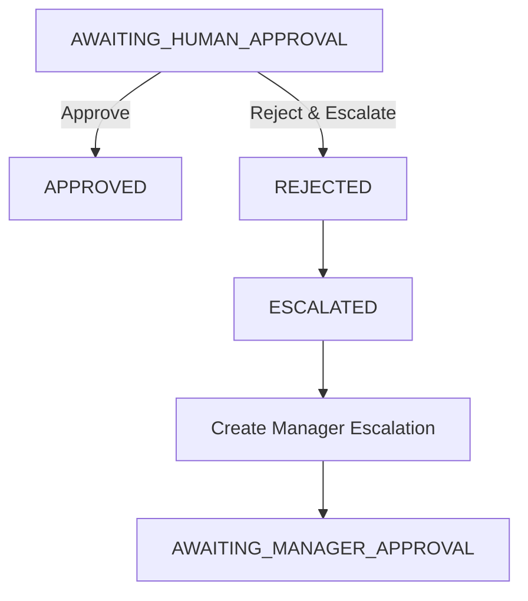

The admin must provide a rejection reason.

---

# 26. Manager Escalation

When a transaction is escalated, the manager must receive the complete context.

The escalation must include:

```text
Transaction ID
Customer
Invoice
Payment
Amount
Difference
Severity
Discrepancy Type
Root Cause
Root Cause Confidence
Evidence Summary
Retrieved Documents
Relevant Policies
AI Recommendation
Customer Email Draft
Admin Rejection Reason
Investigation URL
```

The manager escalation draft should be generated by the AI but populated only from verified investigation data.

Example:

```text
Transaction TX-2496 requires manager review.

Customer:
Acme Corporation

Invoice:
INV-1042

Invoice Amount:
$12,400

Payment:
$14,015.86

Difference:
$1,615.86

Discrepancy:
Overpayment

AI Root Cause:
Customer payment exceeds the outstanding invoice balance.

Confidence:
95%

Recommendation:
Refund $1,615.86 or apply the excess amount to another outstanding invoice.

Admin Decision:
Rejected the proposed resolution and escalated for manager review.

Customer communication draft:
[full draft]

Please review the investigation and determine the appropriate action.
```

---

# 27. Manager Decision Flow

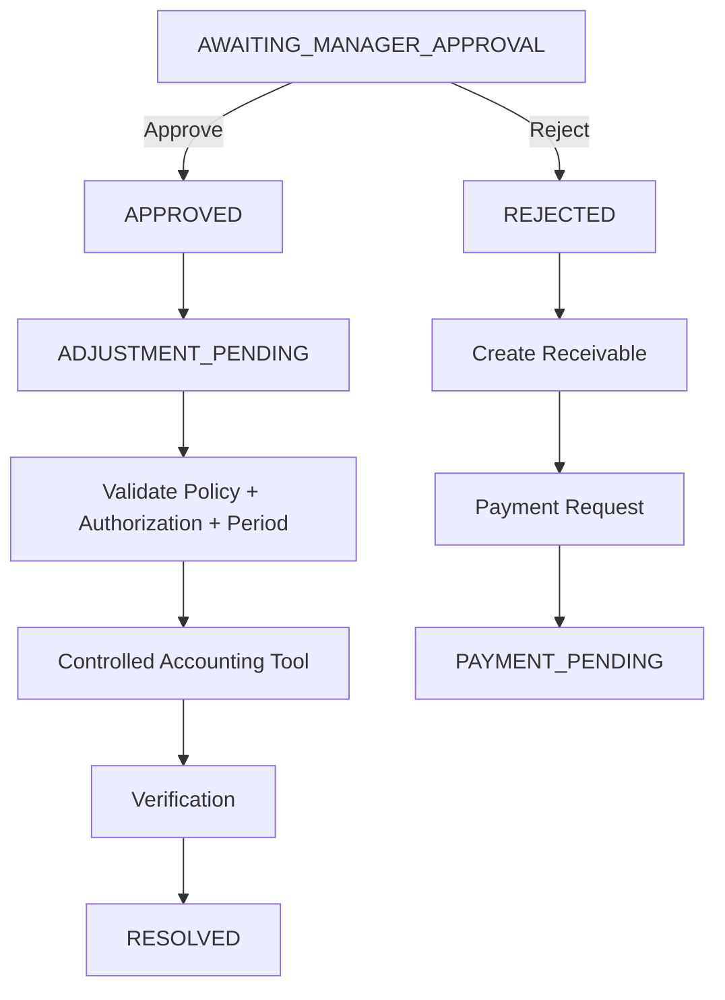

---

# 28. Customer Payment Recovery

If the manager rejects an adjustment and determines that the customer owes money:

```text
Manager Rejects
↓
Create Receivable
↓
Payment Request
↓
Customer Email
↓
PAYMENT_PENDING
↓
Payment Arrives
↓
Reconcile
↓
RESOLVED
```

The transaction must not become resolved merely because the payment request was sent.

---

# 29. Overpayment Refund Flow

Overpayment has a separate financial path.

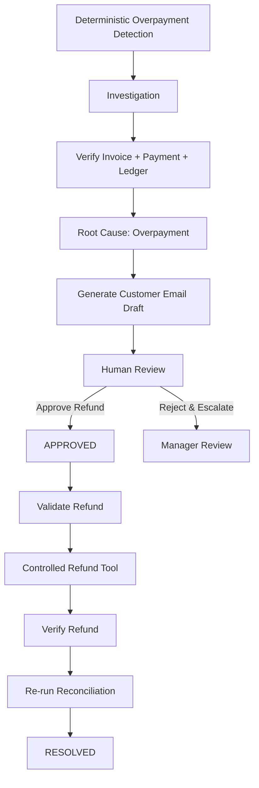

If the admin chooses to apply the overpayment to another invoice instead, that must also require explicit authorization.

---

# 30. Accounting Provider

The system uses an abstraction:

```python
class AccountingProvider:

    def create_journal_entry(...):
        ...

    def get_journal_entry(...):
        ...

    def get_account_balance(...):
        ...

    def create_receivable(...):
        ...

    def create_refund(...):
        ...

    def verify_transaction(...):
        ...

    def verify_reconciliation(...):
        ...
```

The first implementation is:

```text
MockAccountingProvider
```

The mock provider must maintain real internal accounting state.

It must support:

* accounts
* balances
* journal entries
* refunds
* receivables
* external IDs
* idempotency
* validation
* failure simulation
* verification

---

# 31. Journal Entry Execution

For a $500 approved discount:

```text
Debit:
Discount Expense       $500

Credit:
Accounts Receivable    $500
```

The system must validate:

```text
Debit = Credit
```

before posting.

The journal must not be created directly from the browser.

---

# 32. Verification

After a financial action:

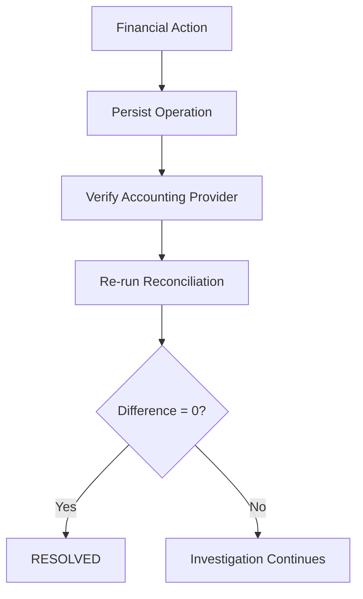

Verification must be deterministic.

---

# 33. Financial State Machine

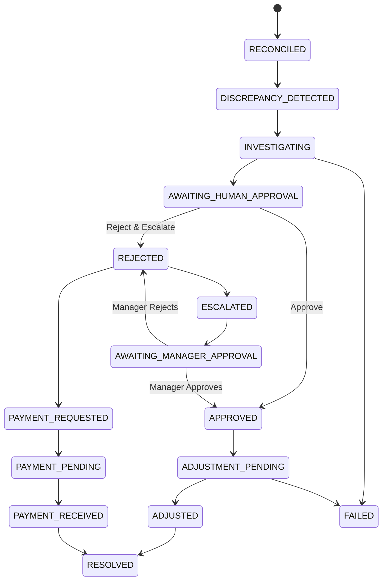

The backend owns transitions.

The frontend cannot arbitrarily set:

```text
status = APPROVED
```

---

# 34. Frontend Architecture

The frontend is a finance control room.

Primary screens:

```text
Financial Close
├── Periods
├── Transactions
├── Discrepancies
├── Investigations
├── Approvals
└── Reports
```

Every page should have contextual search.

---

# 35. Financial Close Dashboard

The main page should show:

```text
Current Period
Transactions
Reconciled
Discrepancies
Open Investigations
Awaiting Approval
Escalated
Resolved
Unresolved Amount
```

The main transaction area must include:

```text
Search
Status Filter
Customer Filter
Amount / Price Filter
Severity Filter
Discrepancy Type Filter
```

---

# 36. Transaction List

Each transaction should display:

```text
Transaction ID
Customer
Amount
Invoice
Payment
Difference
Severity
Discrepancy Type
Status
Investigation Status
```

Example:

```text
TX-2496
Acme Corp
$14,015.86
Difference: $1,615.86
Severity: HIGH
Discrepancy: OVERPAYMENT
Status: AWAITING_HUMAN_APPROVAL
```

Transactions must not automatically trigger investigations.

Each discrepancy transaction should have:

```text
[ Investigate ]
```

---

# 37. Transaction Investigation Page

The page should be organized for an administrator.

```text
← Back to Financial Close

Transaction TX-2496

Severity: HIGH
Status: AWAITING_HUMAN_APPROVAL

Financial Summary

Customer
Invoice
Payment
Bank Transaction
Ledger
Difference

What Happened

Root Cause

Evidence

Agent Findings

Retrieved Documents

Policies

Recommendation

Customer Communication

Financial Impact

Journal Entry

Approval
```

---

# 38. Evidence Presentation

Do not display only logs such as:

```text
LangGraph analysis initiated
ARQ worker picked up job
Policy evaluation completed
```

Those are operational events.

The administrator needs actual findings.

Instead display:

```text
Reconciliation Agent

Finding:
Payment exceeded the open invoice balance by $1,615.86.

Evidence:
Invoice INV-1042
Payment PAY-9001

Confidence:
96%
```

---

# 39. Agent Findings UI

Each agent should have a visible section.

Example:

```text
AI INVESTIGATION

Reconciliation Agent
────────────────────
Found:
Payment exceeds invoice balance by $1,615.86.

Evidence:
INV-1042
PAY-9001

Confidence: 98%
```

```text
Policy Agent
────────────────────
Found:
FIN-042 requires approval for refunds above the configured threshold.

Retrieved:
FIN-042
Page 7

Relevance: 94%
Confidence: 91%
```

```text
Graph Agent
────────────────────
Found:
Customer → Invoice → Payment → Bank Transaction → Ledger

No matching open invoice was found for the excess payment.

Confidence: 89%
```

```text
Root Cause Agent
────────────────────
Root Cause:
Customer overpayment.

Confidence:
95%
```

---

# 40. Customer Email Draft UI

The complete AI-generated customer email must appear above the approval buttons.

Required layout:

```text
CUSTOMER COMMUNICATION

Subject:
Payment received in excess of outstanding balance

────────────────────────────────────

Dear Acme Corporation,

We received a payment of $14,015.86 against
invoice INV-1042, which has an outstanding
balance of $12,400.00.

This leaves an unapplied amount of $1,615.86.

We can either apply this amount to another
outstanding invoice or arrange a refund.

Please let us know how you would like us
to proceed.

Regards,
Finance Team

────────────────────────────────────

[ Edit Draft ]
```

Then:

```text
ADMIN DECISION

[ Approve ]
[ Reject & Escalate ]
```

The complete draft must be visible before the administrator decides.

---

# 41. Manager Escalation UI

When escalated, show:

```text
MANAGER ESCALATION

Transaction
Customer
Invoice
Payment
Difference
Severity

Root Cause

Evidence

Policies

AI Recommendation

Admin Rejection Reason

Customer Email Draft

Manager AI Draft

Investigation Link
```

The manager should not receive only:

```text
Transaction requires review.
```

The manager must receive the full decision context.

---

# 42. Search and Filtering

The main financial close page requires:

```text
Search transactions
```

Search should support:

* transaction ID
* customer name
* invoice ID
* payment ID
* account
* discrepancy type

Filters:

```text
Status
Customer
Severity
Discrepancy Type
Amount
Period
Investigation Status
```

Filtering must be backend-aware where datasets become large.

---

# 43. Contextual Page Search

Every page should have a search control relevant to that page.

Examples:

```text
Financial Close
→ Transactions / customers / invoices

Transaction
→ Documents / evidence / related records

Investigation
→ Evidence / agents / policies

Users
→ Users / account records

Reports
→ Report fields / transactions
```

---

## Search result dismissal

If a search result panel is open:

```text
[ Search Query                 ][ X ]
```

Clicking `X` must:

1. clear the query
2. close the search result panel
3. restore the default page state

---

# 44. Navigation and Back Behavior

The transaction page must preserve the page from which the administrator arrived.

If the user came from:

```text
Financial Close
```

then:

```text
← Back
```

must return to the Financial Close page.

It must not always navigate to a hardcoded overview page.

Prefer browser navigation/history where appropriate.

Example:

```text
Financial Close
      ↓
Transaction
      ↓
Back
      ↓
Financial Close
```

If the transaction was opened from a filtered result, preserve:

* search query
* filters
* period
* pagination
* sort

where possible.

---

# 45. User Account Records

When an administrator clicks:

```text
View Records
```

the route must resolve the selected user's records.

It must not return:

```text
404 Not Found
```

for existing users.

The backend must enforce:

```text
requested_user_id
```

and only return records belonging to that user where authorization allows it.

The frontend must not guess the user's records.

---

# 46. Frontend State Synchronization

The frontend does not own financial state.

Required architecture:

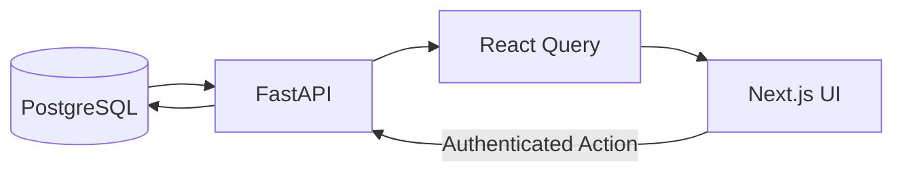

After approval/rejection, invalidate:

```text
transaction
investigation
approval
discrepancy
dashboard
period
close report
```

No manual refresh should be required.

For long-running investigations use:

* polling
* SSE
* WebSockets

---

# 47. API Architecture

The frontend communicates exclusively through FastAPI.

API responsibilities:

```text
Authentication
Authorization
Validation
State Validation
Idempotency
Transaction Queries
Investigation Creation
Decision Handling
User Record Access
Search
Filtering
```

---

# 48. API Endpoints

Suggested endpoints:

```text
GET  /api/v1/workspace/transactions
GET  /api/v1/workspace/transactions/{transaction_id}

GET  /api/v1/workspace/discrepancies
GET  /api/v1/workspace/discrepancies/{id}

POST /api/v1/transactions/{transaction_id}/investigate

GET  /api/v1/transactions/{transaction_id}/investigation

POST /api/v1/transactions/{transaction_id}/decision

GET  /api/v1/transactions/{transaction_id}/evidence

GET  /api/v1/transactions/{transaction_id}/relationships

GET  /api/v1/transactions/{transaction_id}/documents

GET  /api/v1/transactions/{transaction_id}/communication

GET  /api/v1/transactions/{transaction_id}/escalation

GET  /api/v1/users/{user_id}/records
```

Decision example:

```http
POST /api/v1/transactions/TX-2496/decision
```

```json
{
  "decision": "approved",
  "reason": "Evidence supports the recommended refund."
}
```

Reject:

```json
{
  "decision": "rejected",
  "reason": "I do not approve this resolution and want manager review."
}
```

The backend converts this to:

```text
REJECTED
→ ESCALATED
→ AWAITING_MANAGER_APPROVAL
```

---

# 49. Data Model

Core tables:

```text
users
customers
accounts

transactions
invoices
invoice_lines
payments
bank_transactions

ledger_entries
journal_entries
credit_notes
refunds

discrepancies
investigations
investigation_steps
agent_findings
evidence
retrieved_documents

policies
recommendations

approvals
manager_approvals
adjustments

payment_requests
notifications

accounting_periods
audit_events
idempotency_keys
```

---

# 50. Investigation Persistence

An investigation should persist:

```text
investigation_id
transaction_id
status
started_at
completed_at

deterministic_result

agent_findings

evidence

retrieved_documents

policies

root_cause

root_cause_confidence

recommendation

customer_email_draft

manager_escalation_draft

final_summary

human_decision

manager_decision

resolution

workflow_version
```

---

# 51. Redis and ARQ

Long-running investigations must not depend on an open HTTP request.

Required:

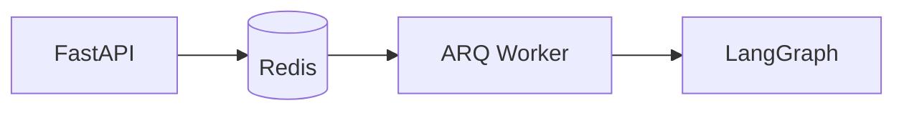

Benefits:

* retries
* concurrency
* worker recovery
* durable job execution
* asynchronous investigation

---

# 52. LangGraph Persistence

LangGraph must support:

* durable state
* checkpointing
* interruption
* human approval
* manager approval
* resume
* worker restart

Required flow:

```text
LangGraph
↓
Interrupt
↓
Persist checkpoint
↓
Human decision
↓
Command resume
```

---

# 53. LLM Provider Architecture

LLM calls should go through a backend abstraction.

Example:

```python
class LLMProvider:

    async def generate_structured(...):
        ...

    async def generate_text(...):
        ...
```

The workflow must not be tightly coupled to one provider endpoint.

---

# 54. LLM Fallback Strategy

Primary investigation model:

```text
meta-llama/Llama-3.3-70B-Instruct
```

If the provider reports:

```text
402 Payment Required
credits depleted
monthly included credits exhausted
provider unavailable
model unavailable
timeout
```

the system must automatically retry using:

```text
meta-llama/Llama-3.1-8B-Instruct
```

Required flow:

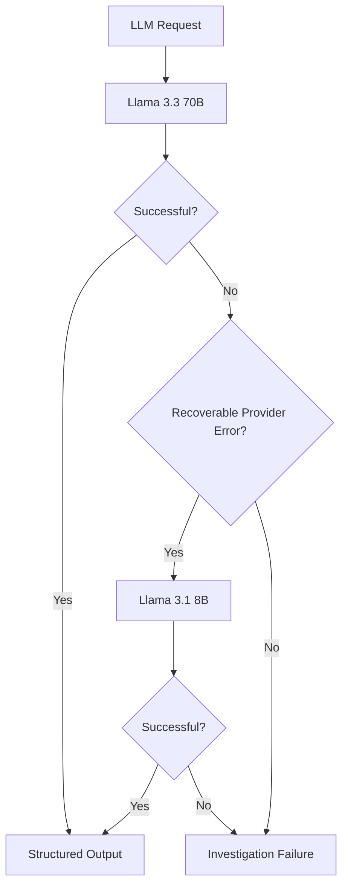

The fallback must be observable.

Store:

```text
primary_model
fallback_model
fallback_reason
provider_error
```

Do not silently hide that fallback occurred.

---

# 55. Insight Schema

The current error:

```text
Field required: period
Field required: summary
recommendations.0:
Input should be a valid string
```

means the model output and the Pydantic schema do not agree.

The schema must be redesigned around the actual output.

Example:

```python
class Recommendation(BaseModel):
    transaction_id: str
    title: str
    description: str
    amount: Decimal | None = None
```

```python
class Insight(BaseModel):
    period: str
    summary: str

    overview: dict

    recommendations: list[Recommendation]

    root_cause: str | None = None
    confidence: float | None = None
```

The LLM should use structured output.

The deterministic fallback must produce the same schema.

The API must never return one schema for LLM output and another for deterministic fallback.

Required architecture:

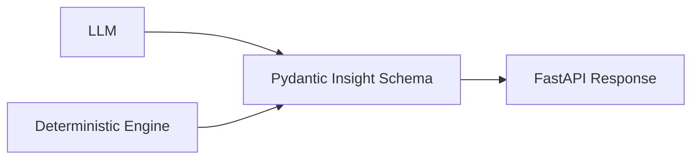

---

# 56. AgentMail

AgentMail is responsible for sending approved customer communication.

The flow must be:

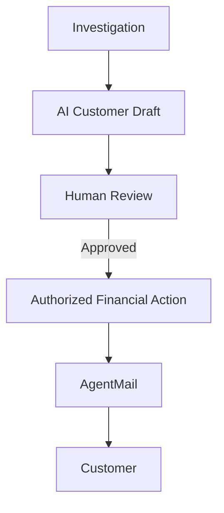

Do not send a customer email simply because the AI generated a draft.

The draft is visible to the administrator first.

---

# 57. Notification Failure Semantics

Financial state and notifications are separate.

If:

```text
Ledger = SUCCESS
Email = FAILED
```

the transaction remains:

```text
ADJUSTED
```

not:

```text
FAILED
```

Persist:

```text
ledger_operation = SUCCESS
email_operation = FAILED
```

Retry the notification independently.

Similarly:

```text
Slack failure
```

must not automatically roll back a persisted financial decision.

---

# 58. Security

Security boundaries:

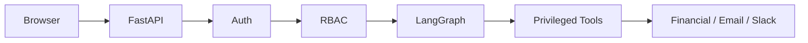

The browser must never have credentials for:

* PostgreSQL
* Pinecone
* Neo4j
* Slack
* AgentMail
* Accounting Provider
* LLM Provider

---

# 59. Authentication and Authorization

Every privileged action requires:

```text
Authentication
+
Authorization
+
Current State Validation
+
Idempotency
```

The backend must verify:

```text
Who is the user?
What role do they have?
Can they approve this transaction?
Is the transaction in the correct state?
Is the accounting period open?
Has this action already happened?
```

---

# 60. Idempotency

Every financial mutation must be idempotent.

Example:

```text
transaction_id
approval_id
action_type
workflow_version
```

Generate an idempotency key.

Before execution:

```text
Does this action already exist?

YES → return existing result.

NO → execute.
```

Double-clicking:

```text
Approve
Approve
```

must never create two journal entries.

---

# 61. Accounting Period Safety

Every transaction belongs to an accounting period.

Before a financial mutation:

```text
Is period OPEN?
```

If:

```text
OPEN
```

continue.

If:

```text
CLOSED
```

block the operation.

Reopening requires:

```text
authorized user
+
reason
+
audit event
```

No silent modifications.

---

# 62. Auditability

Every financial mutation must record:

```text
actor
timestamp
transaction_id
investigation_id
approval_id
action_type
previous_state
new_state
reason
workflow_version
external_provider_id
idempotency_key
```

The audit trail should allow an administrator to answer:

```text
What happened?
Who approved it?
Why?
What evidence supported it?
What action occurred?
What changed?
Was the transaction actually reconciled?
```

---

# 63. Observability

Track:

### Workflow

* investigation duration
* agent duration
* queue latency
* retries
* failure rate
* approval latency
* escalation latency

### Retrieval

* retrieval latency
* relevance
* reranker scores
* evidence count
* retrieval failures

### LLM

* model
* provider
* latency
* token usage
* structured-output failures
* fallback count
* fallback reason

### Financial

* discrepancy count
* discrepancy value
* unresolved value
* refunds
* adjustments
* payment recovery
* resolved investigations

Langfuse should trace:

```text
ARQ Job
→ LangGraph
→ Agent
→ Retrieval
→ LLM
→ Tool
→ Result
```

---

# 64. Evaluation

Maintain a golden dataset containing:

```text
transaction
expected discrepancy
expected root cause
expected evidence
expected policy
expected recommendation
expected action
expected final state
```

Evaluate:

* discrepancy detection
* root cause accuracy
* evidence relevance
* retrieval precision
* policy compliance
* recommendation correctness
* hallucination
* structured output validity
* confidence calibration
* state transition correctness
* final resolution correctness

---

# 65. Testing Strategy

## Unit Tests

Test:

* reconciliation
* overpayment detection
* journal validation
* refund calculation
* policy rules
* authorization
* state transitions
* idempotency
* Pydantic schemas

## Integration Tests

Test:

* PostgreSQL
* Redis
* Pinecone
* Neo4j
* AccountingProvider
* AgentMail
* Slack
* LLM provider

## Workflow Tests

### Investigation

```text
Discrepancy
→ Admin Investigates
→ Evidence
→ Root Cause
→ Recommendation
→ Human Review
```

### Approval

```text
Approve
→ Validate
→ Accounting Action
→ Verify
→ Resolved
```

### Rejection

```text
Reject & Escalate
→ Manager
```

### Manager Rejection

```text
Manager Reject
→ Receivable
→ Payment Request
→ Payment Received
→ Reconcile
→ Resolved
```

### Overpayment

```text
Overpayment
→ Evidence
→ Refund Recommendation
→ Customer Draft
→ Approval
→ Refund
→ Verification
```

### Fallback

```text
Llama 3.3 70B
→ 402
→ Llama 3.1 8B
→ Structured Output
```

---

# 66. Failure and Recovery

If investigation fails:

```text
INVESTIGATING
→ FAILED
```

The admin can retry.

If the worker dies:

```mermaid
flowchart TD

    JOB[Investigation Job]

    JOB --> WORKER[ARQ Worker]

    WORKER --> CHECKPOINT[LangGraph Checkpoint]

    WORKER -->|Crash| RESTART[Worker Restart]

    RESTART --> CHECKPOINT

    CHECKPOINT --> RESUME[Resume Investigation]
```

No investigation should depend on process memory alone.

---

# 67. Deployment Architecture

```mermaid
flowchart TB

    USER[Finance Admin]

    WEB[Next.js]

    API[FastAPI]

    WORKER[ARQ Worker]

    PG[(PostgreSQL)]

    REDIS[(Redis)]

    PINE[Pinecone]

    NEO[Neo4j]

    LLM[Llama Provider]

    VISION[Qwen2.5-VL]

    ACCOUNTING[Accounting Provider]

    EMAIL[AgentMail]

    SLACK[Slack]

    USER --> WEB
    WEB --> API

    API --> PG
    API --> REDIS

    REDIS --> WORKER

    WORKER --> PG
    WORKER --> PINE
    WORKER --> NEO
    WORKER --> LLM
    WORKER --> VISION
    WORKER --> ACCOUNTING
    WORKER --> EMAIL
    WORKER --> SLACK
```

The API must remain responsive while investigations run asynchronously.

---

# 68. Environment Variables

`.env.example`:

```env
DATABASE_URL=
REDIS_URL=

PINECONE_API_KEY=
PINECONE_INDEX=
PINECONE_NAMESPACE=

NEO4J_URI=
NEO4J_USERNAME=
NEO4J_PASSWORD=

SLACK_BOT_TOKEN=
SLACK_SIGNING_SECRET=
SLACK_CHANNEL_ID=

EMAIL_PROVIDER=agentmail
AGENTMAIL_API_KEY=
EMAIL_FROM=

LLM_PROVIDER=
LLM_API_KEY=
PRIMARY_LLM_MODEL=meta-llama/Llama-3.3-70B-Instruct
FALLBACK_LLM_MODEL=meta-llama/Llama-3.1-8B-Instruct

VISION_MODEL=Qwen2.5-VL-72B

ACCOUNTING_PROVIDER=mock
ACCOUNTING_BASE_URL=
ACCOUNTING_API_KEY=

JWT_SECRET=

LANGFUSE_PUBLIC_KEY=
LANGFUSE_SECRET_KEY=
LANGFUSE_HOST=
```

Never expose these through:

```text
NEXT_PUBLIC_*
```

---

# 69. External Services

| Service            | Purpose                       | Requirement |
| ------------------ | ----------------------------- | ----------- |
| PostgreSQL         | Source of truth               | Required    |
| Redis              | Queue/workflow infrastructure | Required    |
| ARQ                | Background jobs               | Required    |
| Pinecone           | Investigation memory          | Required    |
| Neo4j              | Financial relationship graph  | Recommended |
| Llama 3.3 70B      | Primary reasoning             | Required    |
| Llama 3.1 8B       | Fallback reasoning            | Required    |
| Qwen2.5-VL-72B     | Vision/document intelligence  | Required    |
| AgentMail          | Customer email                | Required    |
| Slack              | Manager escalation            | Recommended |
| AccountingProvider | Financial mutation            | Required    |
| Langfuse           | AI observability              | Recommended |

---

# 70. Technology Stack

## Backend

```text
Python
FastAPI
LangGraph
SQLAlchemy
PostgreSQL
Redis
ARQ
Pydantic
```

## AI

```text
Llama 3.3 70B Instruct
Llama 3.1 8B Instruct
Qwen2.5-VL-72B
BGE-M3
Cross Encoder
BM25
Hybrid RAG
Graph RAG
```

## Data

```text
PostgreSQL
Pinecone
Neo4j
Redis
```

## Frontend

```text
Next.js
React
TypeScript
React Query
Tailwind CSS
```

## Integrations

```text
AgentMail
Slack
AccountingProvider
```

## Observability

```text
Langfuse
Prometheus-compatible metrics
```

---

# 71. Design Tradeoffs

## LLM vs Deterministic Code

Use deterministic code for:

```text
Money
Balances
Reconciliation
Authorization
State
Journal validation
```

Use AI for:

```text
Interpretation
Reasoning
Evidence synthesis
Root-cause analysis
Communication
```

---

## Automatic Investigation vs Explicit Investigation

### Decision

Do not automatically investigate every transaction.

Deterministic reconciliation can detect discrepancies.

The administrator chooses which discrepancy requires AI investigation.

This prevents:

* unnecessary LLM cost
* unnecessary investigation jobs
* noisy AI results
* unnecessary workflow state
* excessive model usage

---

## One Model vs Multiple Models

Use different models where appropriate.

```text
Llama 3.3 70B
→ complex investigation

Llama 3.1 8B
→ fallback / lower-cost reasoning

Qwen2.5-VL-72B
→ document intelligence
```

---

## Vector RAG vs Graph RAG

Vector search is useful for:

```text
Policies
Documents
Semantic similarity
```

Graph RAG is useful for:

```text
Customer relationships
Invoice relationships
Payment relationships
Transaction lineage
Multi-hop investigation
```

SQL remains preferred for authoritative structured financial data.

---

## Pinecone vs PostgreSQL

PostgreSQL:

```text
Truth
```

Pinecone:

```text
Precedent
```

Never reverse these roles.

---

## Human Approval vs Autonomous Execution

The system deliberately sacrifices some autonomy to preserve:

* control
* accountability
* auditability
* financial safety

---

## Llama 3.3 70B vs Llama 3.1 8B

The larger model is preferred for complex reasoning.

The smaller model prevents the entire workflow from failing when the primary provider is unavailable or credits are exhausted.

The fallback must still satisfy the same structured output contract.

---

# 72. Example Investigation

Consider:

```text
Transaction:
TX-2496

Customer:
Acme Corporation

Invoice:
INV-1042

Invoice:
$12,400

Payment:
$14,015.86

Difference:
+$1,615.86
```

Deterministic reconciliation identifies:

```text
OVERPAYMENT
```

The admin clicks:

```text
[ Investigate ]
```

The system retrieves:

```text
PostgreSQL
Invoice
Payment
Customer
Ledger
Bank Transaction

Neo4j
Financial relationships

Pinecone
Similar historical investigations

Documents
Supporting financial records

Policies
Refund / unapplied cash policies
```

The agents produce:

```text
Reconciliation Agent

Finding:
Payment exceeds the outstanding invoice balance by $1,615.86.

Confidence:
98%
```

```text
Graph Agent

Finding:
The excess payment is not linked to another open invoice.

Confidence:
89%
```

```text
Policy Agent

Finding:
Refunding unapplied cash requires administrator approval.

Retrieved:
Refund Policy
Page 7

Relevance:
94%
Confidence:
91%
```

Root cause:

```text
Customer overpayment.

Confidence:
95%
```

Recommendation:

```text
Refund $1,615.86 or apply the excess amount
to another outstanding invoice.
```

Customer draft:

```text
Subject:
Payment received in excess of outstanding balance

Dear Acme Corporation,

We received a payment of $14,015.86 against
invoice INV-1042, which has an outstanding
balance of $12,400.00.

This leaves an unapplied amount of $1,615.86.

We can either apply this amount to another
outstanding invoice, where applicable, or
arrange a refund.

Please let us know how you would like us
to proceed.

Regards,
Finance Team
```

The administrator sees:

```text
[ Approve ]
[ Reject & Escalate ]
```

If approved:

```text
APPROVED
→ ADJUSTMENT_PENDING
→ Validate
→ Refund
→ Verify
→ Reconcile
→ RESOLVED
```

If rejected:

```text
REJECTED
→ ESCALATED
→ AWAITING_MANAGER_APPROVAL
```

The manager receives the complete investigation and AI-generated escalation draft.

---

# 73. Repository Structure

```text
financial-close/

├── backend/
│   ├── app/
│   │   ├── api/
│   │   ├── auth/
│   │   ├── agents/
│   │   ├── accounting/
│   │   ├── reconciliation/
│   │   ├── investigation/
│   │   ├── retrieval/
│   │   ├── graph/
│   │   ├── ingestion/
│   │   ├── notifications/
│   │   ├── workflows/
│   │   ├── llm/
│   │   ├── models/
│   │   ├── schemas/
│   │   ├── services/
│   │   └── main.py
│   │
│   ├── tests/
│   ├── alembic/
│   └── requirements.txt
│
├── frontend/
│   ├── app/
│   │   ├── dashboard/
│   │   ├── financial-close/
│   │   ├── transactions/
│   │   ├── investigations/
│   │   ├── approvals/
│   │   ├── users/
│   │   └── reports/
│   │
│   ├── components/
│   ├── hooks/
│   ├── lib/
│   └── types/
│
├── knowledge/
│   ├── accounting/
│   ├── policies/
│   ├── procedures/
│   ├── investigation/
│   ├── rag/
│   └── graph/
│
├── documents/
│   ├── invoices/
│   ├── bank_statements/
│   ├── receipts/
│   ├── credit_notes/
│   └── approvals/
│
├── data/
│   ├── customers/
│   ├── invoices/
│   ├── payments/
│   ├── bank_transactions/
│   └── ledger/
│
├── ground_truth/
│   ├── discrepancies/
│   ├── root_causes/
│   ├── evidence/
│   └── expected_resolutions/
│
├── scripts/
├── docker/
├── .env.example
├── docker-compose.yml
└── README.md
```

---

# 74. Development Principles

1. Prefer deterministic systems when deterministic systems are sufficient.

2. Do not investigate every transaction automatically.

3. Let administrators explicitly trigger expensive investigations.

4. Give the LLM the smallest useful responsibility.

5. Persist important state before starting long-running work.

6. Never trust frontend state for authorization.

7. Never let an LLM directly mutate financial records.

8. Every financial mutation must be idempotent.

9. Every important conclusion should have evidence.

10. Every retrieved document should expose relevance and confidence where available.

11. Show the actual finding, not only operational logs.

12. Every investigation must expose its root cause.

13. Every investigation must expose its recommendation.

14. Generate customer communication from verified financial facts.

15. Show the complete customer draft before approval.

16. Rejected recommendations escalate to management.

17. Manager escalation must contain the full investigation context.

18. Slack actions must route through authenticated backend endpoints.

19. The browser must never access privileged financial services.

20. PostgreSQL is the source of truth.

21. Pinecone is precedent memory.

22. Neo4j is relationship context.

23. Retrieval results are evidence, not authority.

24. Closed accounting periods require explicit controls.

25. Financial actions must be verified after execution.

26. Notification failure must not incorrectly mark a successful financial operation as failed.

27. LLM fallback must preserve the same output contract.

28. AI-generated text must never override deterministic financial facts.

29. Human approval is a system boundary, not merely a UI button.

30. The frontend reflects backend state; it does not own financial state.

---

# 75. Final Architecture

The complete system behaves as follows:

```mermaid
flowchart TB

    UI[Next.js Financial Close Control Room]

    API[FastAPI<br/>Auth / RBAC / Validation]

    PG[(PostgreSQL<br/>SOURCE OF TRUTH)]

    RECON[Deterministic Reconciliation]

    ADMIN[Admin Clicks Investigate]

    ARQ[Redis + ARQ]

    LG[LangGraph]

    SQL[Financial Records]

    RAG[Hybrid Retrieval]

    NEO[Neo4j]

    PINE[Pinecone]

    DOC[Qwen2.5-VL-72B]

    LLM[Llama 3.3 70B]

    FALLBACK[Llama 3.1 8B]

    ROOT[Root Cause]

    REC[Recommendation]

    CUSTOMER[Customer Email Draft]

    HUMAN[Human Approval]

    SLACK[Manager Escalation]

    MANAGER[Manager Approval]

    LEDGER[Controlled Accounting Tool]

    EMAIL[AgentMail]

    VERIFY[Verification]

    RESOLVED[RESOLVED]

    UI --> API

    API --> PG

    PG --> RECON

    RECON --> ADMIN

    ADMIN --> API

    API --> ARQ

    ARQ --> LG

    LG --> SQL
    LG --> RAG
    LG --> NEO
    LG --> PINE
    LG --> DOC

    LG --> LLM

    LLM -->|Provider failure / credits depleted| FALLBACK

    SQL --> ROOT
    RAG --> ROOT
    NEO --> ROOT
    PINE --> ROOT
    DOC --> ROOT

    ROOT --> REC
    REC --> CUSTOMER

    CUSTOMER --> HUMAN

    HUMAN -->|Approve| LEDGER
    HUMAN -->|Reject & Escalate| SLACK

    SLACK --> MANAGER

    MANAGER -->|Approve| LEDGER
    MANAGER -->|Reject| EMAIL

    LEDGER --> VERIFY
    VERIFY --> RECON

    RECON -->|Difference = 0| RESOLVED

    RESOLVED --> PINE

    LEDGER --> PG
    EMAIL --> PG
    SLACK --> PG
    MANAGER --> PG
```

## Final System Principle

The Financial Close Agent is not an autonomous accounting bot.

It is a **controlled financial investigation system**.

Its responsibility is:

```text
Detect
  ↓
Investigate
  ↓
Retrieve
  ↓
Connect
  ↓
Explain
  ↓
Recommend
  ↓
Draft Communication
  ↓
Request Human Decision
  ↓
Escalate When Rejected
  ↓
Execute Through Controlled Tools
  ↓
Verify
  ↓
Reconcile
  ↓
Resolve
  ↓
Remember
```

The final authority remains:

```text
PostgreSQL
+
Deterministic Financial Logic
+
Backend Authorization
+
Human Approval
```

AI provides the intelligence layer around that controlled system:

```text
Evidence
+
Reasoning
+
Root Cause Analysis
+
Policy Interpretation
+
Recommendations
+
Communication Drafting
+
Workflow Coordination
```

That separation is the central architectural guarantee of the platform.
